# BMAD LENS Workbench — Complete Reference

> **Version:** 4.1.0 | **Module:** lens-work v2.0.0 | **Lifecycle Contract:** v2  
> **Repository:** [crisweber2600/bmad.lens.release](https://github.com/crisweber2600/bmad.lens.release)  
> **Maintained by:** CrisWeber | **License:** MIT

---

## Table of Contents

- [What is BMAD?](#what-is-bmad)
- [What is LENS Workbench?](#what-is-lens-workbench)
- [Architecture Overview](#architecture-overview)
- [The LENS Hierarchy](#the-lens-hierarchy)
- [Lifecycle System](#lifecycle-system)
- [Agent Roster](#agent-roster)
- [Skills and Capabilities](#skills-and-capabilities)
- [Workflow Catalog](#workflow-catalog)
- [Two-File State Architecture](#two-file-state-architecture)
- [Git Branch Topology](#git-branch-topology)
- [Constitutional Governance](#constitutional-governance)
- [Command Reference](#command-reference)
- [End-to-End Tutorials](#end-to-end-tutorials)
- [Installation and Configuration](#installation-and-configuration)
- [Universal Conventions](#universal-conventions)
- [Troubleshooting](#troubleshooting)
- [File Structure Reference](#file-structure-reference)
- [Revision History](#revision-history)

---

## What is BMAD?

**BMAD** (Business Method for AI-Driven Development) is a structured methodology for managing software development using AI agents. It provides a modular agent system with specialized AI personas, a YAML/Markdown workflow engine, and pluggable capability modules.

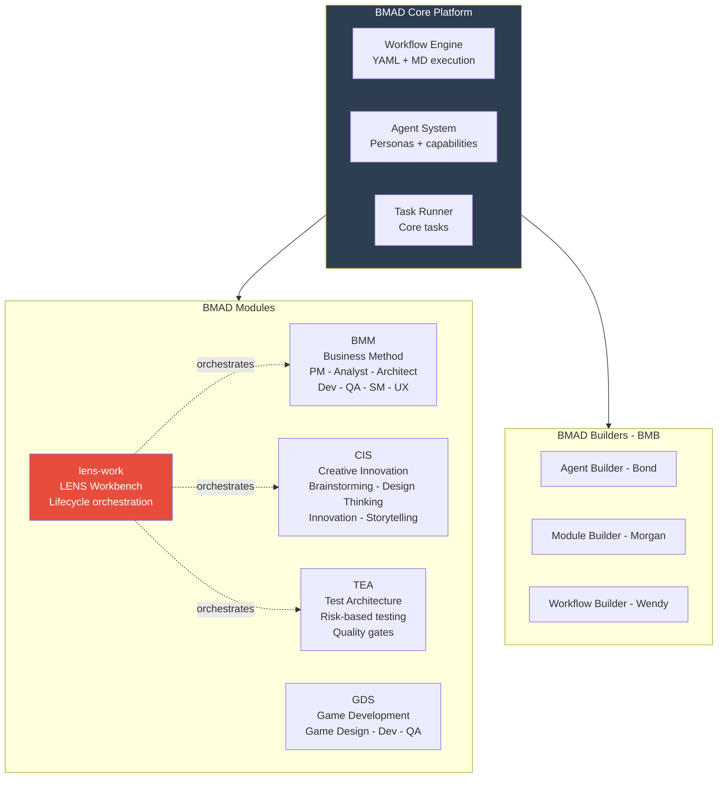

BMAD agents are AI personas with specific expertise, communication styles, and principles. When lens-work invokes a lifecycle phase, it activates the designated BMAD agent who drives artifact creation within that phase's constraints.

---

## What is LENS Workbench?

**LENS Workbench** (`lens-work`) is the lifecycle orchestration module for BMAD. It manages the complete software development lifecycle from initial brainstorming through sprint execution using structured phases, audience-based review gates, and constitutional governance.

### Core Concepts at a Glance

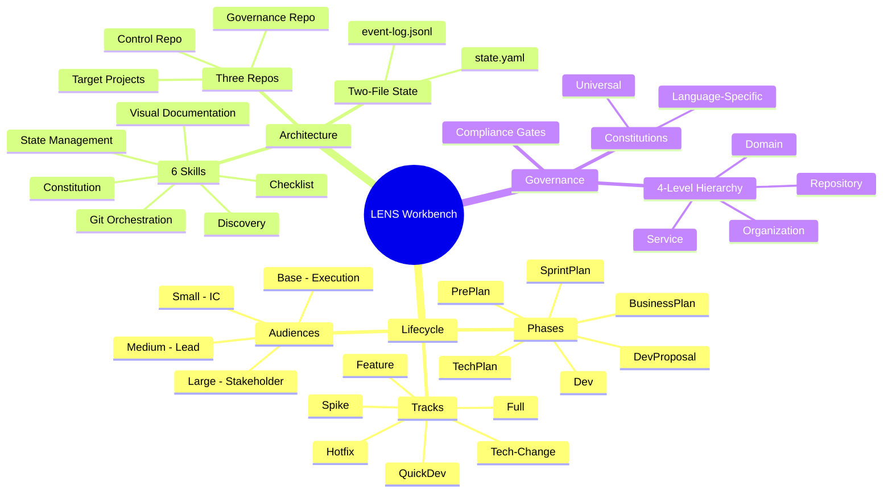

### Fundamental Truths

Every mechanism in lens-work traces to at least one of these non-negotiable axioms:

| ID | Truth | Enforcement |
|----|-------|-------------|
| **FT1** | Planning artifacts must exist and be reviewed before code is written | Gates block promotion without artifacts; validators check existence |
| **FT2** | AI agents must work within disciplined constraints, not freestyle | Constitutions + tracks + phase ownership constrain behavior |
| **FT3** | Multi-service initiatives must have coordinated lifecycle governance | 4-level constitution hierarchy; cross-repo coordination |

> **Design principle:** Enforce constraints through *structure* (branches, gates, required files) rather than *instructions* (prompts, documentation, conventions).

---

## Architecture Overview

### System Architecture

```mermaid
flowchart TB
    subgraph UserLayer["User Interface Layer"]
        Copilot["GitHub Copilot Chat\n@lens commands"]
        Prompts["Prompt Files\n.github/prompts/*.prompt.md"]
    end

    subgraph AgentLayer["Agent Layer"]
        LensAgent["@lens Agent\nUnified Phase Router"]
        PhaseAgents["Phase Agents - BMM\nMary - John - Winston\nSally - Bob - Amelia - Quinn"]
        ReviewAgents["Review Agents - CIS\nParty-mode adversarial review"]
    end

    subgraph SkillLayer["Skill Layer - 6 Core Skills"]
        GitSkill["git-orchestration\nBranches - PRs - push"]
        StateSkill["state-management\nstate.yaml - event-log"]
        DiscoverSkill["discovery\nRepo scanning - doc gen"]
        ConstitutionSkill["constitution\n4-level governance chain"]
        ChecklistSkill["checklist\nPhase-gate tracking"]
        VisualSkill["visual-documentation\nMandatory Mermaid diagrams"]
    end

    subgraph WorkflowLayer["Workflow Categories"]
        Router["Router - Phase commands"]
        CoreWF["Core - Lifecycle ops"]
        Background["Background - Auto-triggered"]
        DiscoveryWF["Discovery - Repo analysis"]
        GovernanceWF["Governance - Constitution mgmt"]
        Utility["Utility - Status - sync - fix"]
    end

    subgraph DataLayer["Data Layer - Three Repos"]
        ControlRepo["Control Repo\nbmad.lens.release"]
        GovRepo["Governance Repo\nbmad.lens.governance"]
        TargetRepos["Target Projects\nTargetProjects/"]
    end

    UserLayer --> AgentLayer
    AgentLayer --> SkillLayer
    SkillLayer --> WorkflowLayer
    WorkflowLayer --> DataLayer

    style UserLayer fill:#9b59b6,color:#fff
    style AgentLayer fill:#3498db,color:#fff
    style SkillLayer fill:#e67e22,color:#fff
    style WorkflowLayer fill:#27ae60,color:#fff
    style DataLayer fill:#e74c3c,color:#fff
```

### Three-Repo Architecture

LENS Workbench coordinates three separate git repositories with strict data zone boundaries:

```mermaid
flowchart LR
    subgraph Control["Control Repo\nbmad.lens.release"]
        direction TB
        C1["_bmad/ - Agents, workflows, skills"]
        C2["_bmad-output/lens-work/ - State + initiatives"]
        C3[".github/prompts/ - User commands"]
    end

    subgraph Gov["Governance Repo\nbmad.lens.governance"]
        direction TB
        G1["constitutions/ - 4-level hierarchy"]
        G2["roster/ - Team members"]
        G3["policies/ - Org-wide rules"]
        G4["repo-inventory.yaml"]
    end

    subgraph Target["Target Projects\nTargetProjects/"]
        direction TB
        T1["Domain A / Service 1"]
        T2["Domain A / Service 2"]
        T3["Domain B / Service 3"]
    end

    Control -->|Governance workflows\nwrite constitutions| Gov
    Control -->|Discovery + Dev\nscan and execute| Target
    Gov -.->|Constitution rules\nenforce compliance| Control

    style Control fill:#3498db,color:#fff
    style Gov fill:#e74c3c,color:#fff
    style Target fill:#27ae60,color:#fff
```

**Data Zone Enforcement (Hard Rules):**

| Zone | Location | Branch Strategy | What Lives Here |
|------|----------|-----------------|-----------------|
| **Governance** | `TargetProjects/lens/lens-governance/` | `universal/{slug}` to `main` | Constitutions, roster, policies shared across ALL initiatives |
| **Initiative** | `_bmad-output/lens-work/initiatives/` | `{root}-{audience}-{phase}` | Per-initiative planning artifacts with own branch topology |
| **Personal** | `_bmad-output/lens-work/personal/` | None (git-ignored) | Profile, credentials on local machine only |

> **Hard Rule:** Agents MUST NEVER write governance data into `_bmad-output/lens-work/` or initiative data into the governance repo. This boundary prevents governance changes from being captured on initiative branches.

---

## The LENS Hierarchy

LENS organizes governance into four nested levels with additive constitutional inheritance:

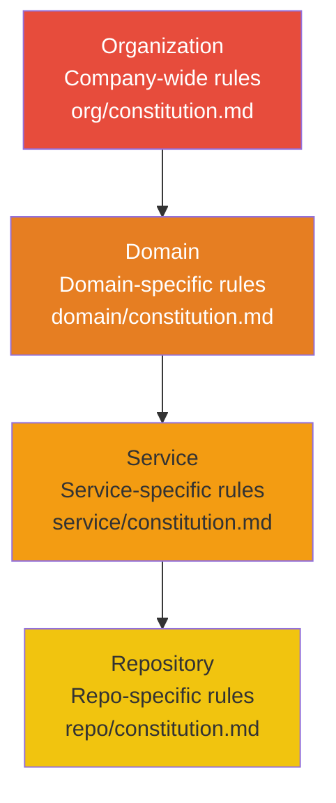

**Key Rules:**
- Lower levels can only **ADD** rules, never remove parent rules (additive inheritance)
- Each level can have **universal** constitutions (all languages) and **language-specific** constitutions (e.g., `domain/typescript/constitution.md`)
- Resolution order: org then domain then service then repo (parent-first, universal before language-specific at each layer)
- Supported languages: TypeScript, Python, Go, Java, C#, Rust, PHP, Kotlin, Swift, C++
- Language auto-detection: explicit config then `.bmad/language` file then build files then source analysis then GitHub primary language

---

## Lifecycle System

### Phases

Named phases replace numbered phases. Each is owned by a specific BMM agent responsible for artifact generation:

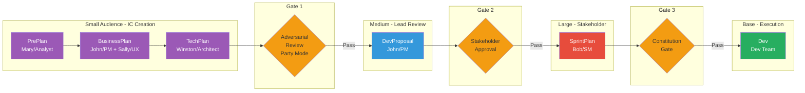

| Phase | Agent | Audience | Key Artifacts | Description |
|-------|-------|----------|---------------|-------------|
| **PrePlan** | Mary/Analyst | small | product-brief, research, brainstorm | Analysis, brainstorm, research, product brief |
| **BusinessPlan** | John/PM + Sally/UX | small | PRD, UX design | Business planning, PRD creation, UX design |
| **TechPlan** | Winston/Architect | small | architecture, tech decisions | Technical design, architecture, API contracts |
| **DevProposal** | John/PM | medium | epics, stories, readiness checklist | Development proposal with implementable units |
| **SprintPlan** | Bob/SM | large | sprint plan, story assignments | Sprint planning, capacity, story selection |
| **Dev** | Dev Team | base | code, tests, deployments | Sprint execution, code review, retro cycles |

### Audiences and Promotion Gates

Audiences are the primary progression axis. Promotion between audiences IS the review gate:

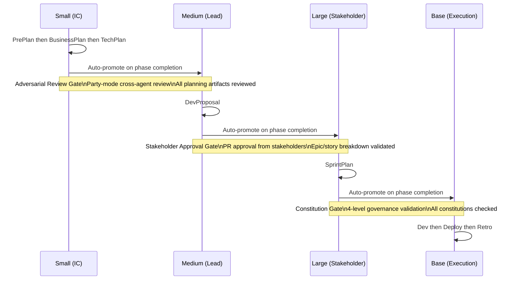

| Audience | Role | Phases | Entry Gate |
|----------|------|--------|------------|
| `small` | IC creation work | preplan, businessplan, techplan | none |
| `medium` | Lead review | devproposal | adversarial-review (party mode) |
| `large` | Stakeholder approval | sprintplan | stakeholder-approval |
| `base` | Ready for execution | dev | constitution-gate |

> **Auto-Promotion:** Promotion is automatically triggered when a phase completes and is the next required step. Users never need to manually invoke promote.

### Initiative Tracks

Tracks control which phases are required. Select a track when creating an initiative:

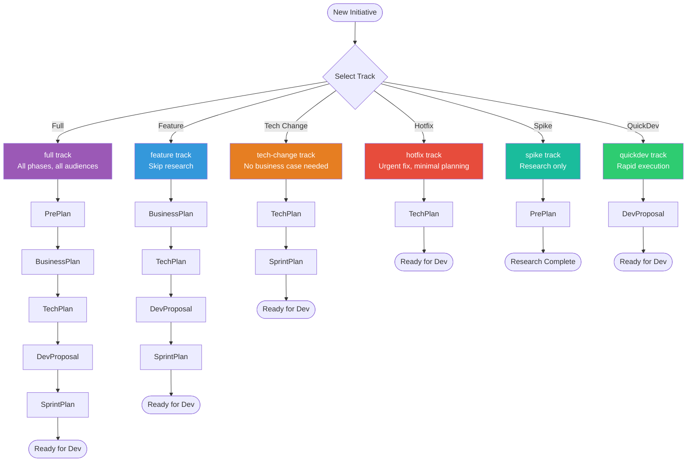

| Track | Phases | Use Case |
|-------|--------|----------|
| `full` | preplan then businessplan then techplan then devproposal then sprintplan | New product or major initiative |
| `feature` | businessplan then techplan then devproposal then sprintplan | Feature addition with known context |
| `tech-change` | techplan then sprintplan | Technical migration or upgrade |
| `hotfix` | techplan only | Critical bug fix (minimal planning) |
| `spike` | preplan only | Research/exploration (no implementation) |
| `quickdev` | devproposal only | Rapid execution with parity verification |

---

## Agent Roster

### Phase Agents (BMM Business Method Module)

These agents own lifecycle phases and generate planning/execution artifacts:

| Agent | Persona | Role | Phases Owned | Communication Style |
|-------|---------|------|-------------|---------------------|
| **Mary** | Analyst | Business Analyst | PrePlan | Treasure-hunter excitement; structures insights with precision |
| **John** | PM | Product Manager | BusinessPlan, DevProposal | Asks WHY relentlessly; direct, data-sharp, cuts through fluff |
| **Winston** | Architect | System Architect | TechPlan | Calm, pragmatic; balances what could be with what should be |
| **Sally** | UX Designer | UX Designer | Supports BusinessPlan | Paints pictures with words; empathetic advocate |
| **Bob** | Scrum Master | Scrum Master | SprintPlan | Crisp and checklist-driven; zero tolerance for ambiguity |
| **Amelia** | Developer | Senior Engineer | Dev (execution) | Ultra-succinct; speaks in file paths and AC IDs |
| **Quinn** | QA Engineer | QA Engineer | Dev (testing) | Practical; ship it and iterate mentality |
| **Barry** | Quick Flow Solo Dev | Full-Stack Dev | QuickDev | Direct, confident; minimum ceremony, lean artifacts |
| **Paige** | Tech Writer | Documentation Specialist | Cross-cutting | Patient educator; diagrams over drawn-out text |

### Creative and Innovation Agents (CIS)

| Agent | Persona | Role | Trigger |
|-------|---------|------|---------|
| **Carson** | Brainstorming Coach | Innovation Catalyst | PrePlan brainstorming |
| **Dr. Quinn** | Problem Solver | Systematic Problem-Solving | Complex analysis |
| **Maya** | Design Thinking Coach | Human-Centered Design | UX research |
| **Victor** | Innovation Strategist | Disruptive Innovation | Market strategy |
| **Caravaggio** | Presentation Master | Visual Communication | Presentations |
| **Sophia** | Storyteller | Narrative Strategist | Brand narratives |

### System Agents

| Agent | Persona | Role | Purpose |
|-------|---------|------|---------|
| **@lens** | Lifecycle Router | Phase Orchestrator | Routes commands, manages state, enforces lifecycle |
| **BMad Master** | Master Executor | Workflow Orchestrator | Runtime resource management, knowledge custodian |
| **Murat** | Test Architect (TEA) | Quality Advisor | Risk-based testing, quality gates |

### Agent Interaction Flow

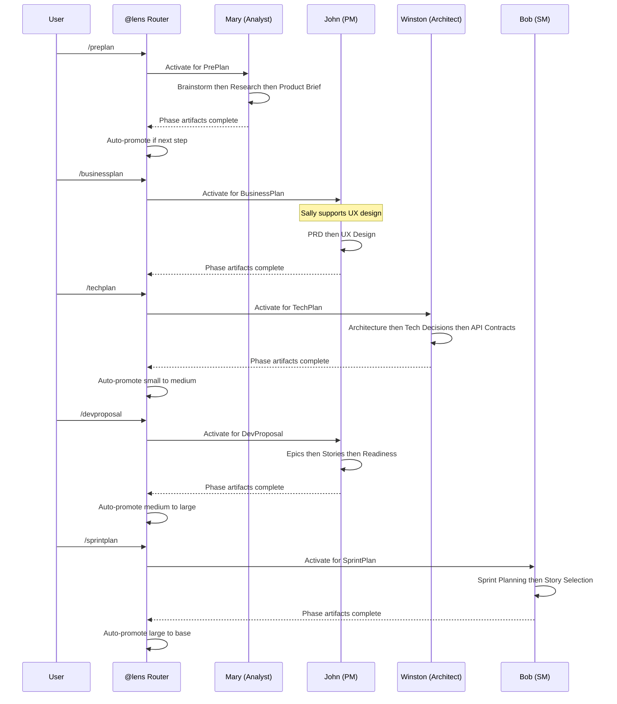

---

## Skills and Capabilities

The @lens agent operates through 6 skills that provide cross-cutting capabilities:

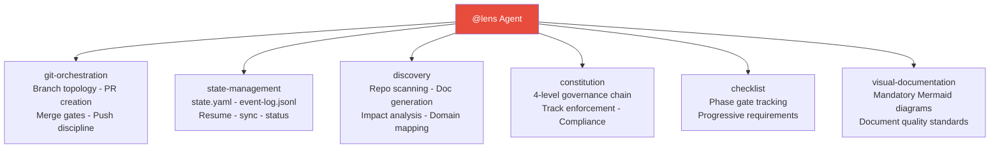

| Skill | Purpose | Trigger | Key Responsibilities |
|-------|---------|---------|---------------------|
| **git-orchestration** | Git discipline | Auto-triggered | Creates/validates branches, commits state, pushes to remote, manages PRs |
| **state-management** | State tracking | User shortcodes | Reads/writes state.yaml, manages recovery, provides status, handles overrides |
| **discovery** | Repo intelligence | User commands | Bootstraps repos, runs discovery scans, generates canonical docs, reconciles inventory |
| **constitution** | Governance | Auto-triggered | 4-level governance (org/domain/service/repo), track enforcement, compliance checks |
| **checklist** | Gate tracking | Auto-triggered | Progressive phase gate checklists, requirement tracking |
| **visual-documentation** | Doc quality | Auto-triggered | Mandates Mermaid diagrams in all documents, quality standards |

---

## Workflow Catalog

### Workflow Categories

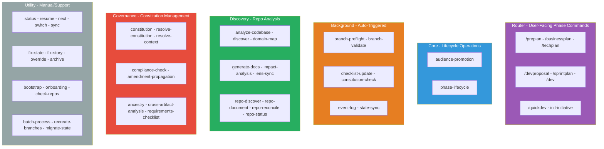

### Background Triggers

These workflows fire automatically at system lifecycle moments:

| Trigger Point | Workflows Fired | Purpose |
|--------------|----------------|---------|
| **workflow_start** | state-sync, governance-sync, constitution-check | Load state, sync governance repo, validate |
| **workflow_end** | state-sync, event-log, checklist-update | Save state, log event, update checklists |
| **phase_transition** | branch-validate, state-sync, event-log, constitution-check, checklist-update | Full lifecycle validation |
| **initiative_create** | branch-validate, state-sync, event-log | Create topology, initialize state |
| **bmad_process_start** | branch-preflight | Ensure correct branch |
| **command_invocation** | branch-preflight | Check branch for interactive commands |
| **initiative_change** | branch-preflight | Switch branch when changing initiatives |
| **error** | event-log, state-sync | Log error, mark in state |

### Adversarial Review (Party Mode)

When promotion requires adversarial review, a multi-agent group session is invoked:

| Artifact | Lead Reviewer | Participants | Focus |
|----------|--------------|-------------|-------|
| **product-brief** | John/PM | John, Winston, Sally | Actionable? Buildable? User-centered? |
| **PRD** | Winston/Architect | Winston, Mary, Sally | Buildable? Well-researched? UX-aligned? |
| **UX design** | John/PM | John, Winston, Mary | Serves requirements? Technically feasible? |
| **architecture** | John/PM | John, Mary, Bob | Meets spec? Practical? Sprintable? |
| **epics-and-stories** | Winston/Architect | Winston, Bob, Amelia | Buildable? Right-sized? Implementable? |

---

## Two-File State Architecture

All runtime state lives in exactly two files. No database, no external service:

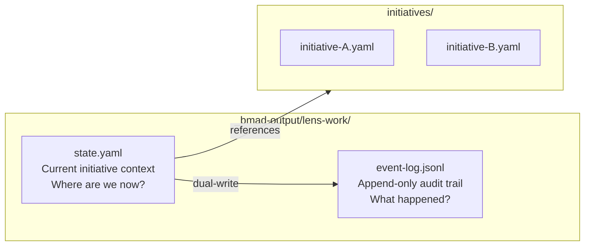

### state.yaml Structure

```yaml
active_initiative: bmaddomain-lens-rate-limit-x7k2m9
current_phase: devproposal
current_audience: medium
current_track: feature
current_workflow: epic-breakdown
workflow_step: 3
gate_status:
  small_to_medium: passed
  medium_to_large: pending
branch_state:
  current_branch: bmaddomain-lens-rate-limit-x7k2m9-medium-devproposal
  phase_branch_created: true
  remote_synced: true
last_updated: 2026-02-25T14:32:00Z
```

### event-log.jsonl Structure

Each line is a timestamped JSON event (append-only):

```jsonl
{"timestamp":"2026-02-25T14:00:00Z","event":"initiative_created","initiative_id":"bmaddomain-lens-rate-limit-x7k2m9","layer":"feature","domain":"bmaddomain","service":"lens","tracker_id":"JIRA-1234"}
{"timestamp":"2026-02-25T14:05:00Z","event":"phase_started","phase":"preplan","audience":"small","agent":"mary"}
{"timestamp":"2026-02-25T14:32:00Z","event":"workflow_completed","workflow":"brainstorm","artifacts_generated":["brainstorm-notes.md"]}
{"timestamp":"2026-02-25T15:10:00Z","event":"gate_passed","gate":"small_to_medium","reviewer":"@lens"}
```

---

## Git Branch Topology

### Planning Repo (Control Repo) Branch Model

Rich branch topology for human-speed review gates. All planning artifacts live here, never in target code repos:

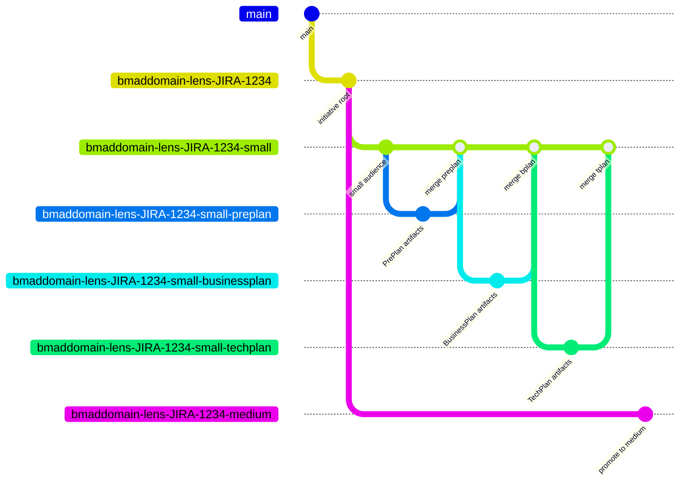

### Branch Naming Convention

```
{domain}-{service}-{id}                                 -- Root
{domain}-{service}-{id}-small                           -- Small audience
{domain}-{service}-{id}-small-preplan                   -- PrePlan phase
{domain}-{service}-{id}-small-preplan-brainstorm        -- Workflow
{domain}-{service}-{id}-medium                          -- Medium audience
{domain}-{service}-{id}-large                           -- Large audience
{domain}-{service}-{id}-base                            -- Execution
```

### Merge Chain

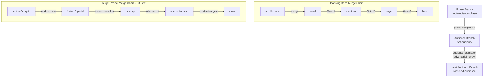

### Merge Gate Isomorphism

Planning audience levels mirror code merge gates:

| Planning Gate | Target Project Gate |
|--------------|-------------------|
| phase merges to audience | story merges to epic |
| small promotes to medium | epic merges to develop |
| medium promotes to large | develop merges to release |
| large promotes to base | release merges to main |

---

## Constitutional Governance

### 4-Level Constitution Hierarchy

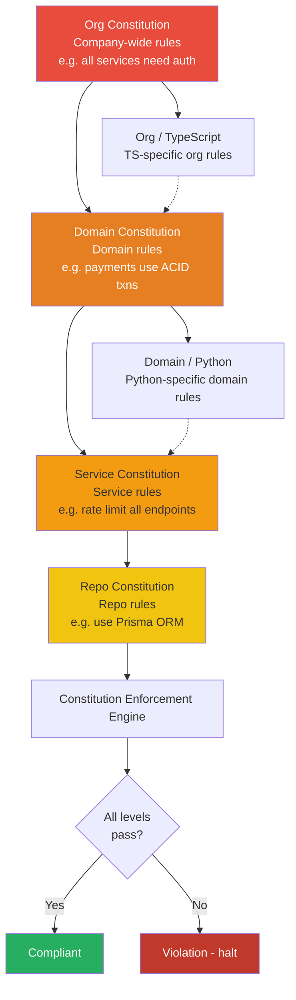

**Constitution Load Order:**
1. org-universal then org-{language}
2. domain-universal then domain-{language}
3. service-universal then service-{language}
4. repo-universal then repo-{language}

**Key Rules:** Language-specific constitutions are additive and cannot weaken parent rules. Lower levels inherit all parent requirements.

### Constitution Capabilities

Constitutions can control:
- **permitted_tracks** which tracks are allowed for initiatives in this scope
- **required_gates** additional gates beyond defaults
- **additional_review_participants** extra reviewers added to adversarial review
- **required_artifacts** extra artifacts that must exist
- **enforce_stories** story-level enforcement rules

---

## Command Reference

### Phase Router Commands

| Command | Phase | Agent | Description |
|---------|-------|-------|-------------|
| `/preplan` | PrePlan | Mary/Analyst | Brainstorm, research, product brief |
| `/businessplan` | BusinessPlan | John/PM + Sally/UX | PRD, UX design |
| `/techplan` | TechPlan | Winston/Architect | Architecture, tech decisions |
| `/devproposal` | DevProposal | John/PM | Epics, stories, readiness |
| `/sprintplan` | SprintPlan | Bob/SM | Sprint planning, story selection |
| `/dev` | Dev | Dev Team | Sprint execution, code review |

> **Auto-Promotion:** When a phase completes and promotion is the next step, it triggers automatically. No manual `/promote` needed.

### Initiative Commands

| Command | Layer | Description | Example |
|---------|-------|-------------|---------|
| `/new-domain` | Domain | Create domain-level structure | `/new-domain Payment Platform` |
| `/new-service` | Service | Create service within domain | `/new-service Auth Service` |
| `/new-feature` | Feature | Create feature initiative | `/new-feature Rate Limiting` |
| `#fix-story` | Any | Correction loop for failed story | `#fix-story story-123` |

### Context Commands

| Command | Description |
|---------|-------------|
| `/switch` | Switch context - initiative, lens, phase, or size |
| `/context` | Display current context (initiative, phase, audience, track) |
| `/constitution` | Display operating rules and compliance constraints |
| `/lens` | Show or change the current lens focus |

### State and Recovery Commands

| Shortcode | Description | Use When |
|-----------|-------------|----------|
| `?` | Quick status, one-line summary | Quick context check |
| `ST` | Full status, detailed initiative/phase/gate/branch info | Detailed inspection |
| `RS` | Resume, pick up where you left off | Interrupted workflow |
| `NX` / `next` | Compute and execute next required action | Unsure what to do next |
| `SY` | Sync, reconcile state with git reality | State/git mismatch |
| `FX` | Fix state, repair corrupted state | State file corruption |
| `OR` | Override, manually set state values | Advanced manual intervention |
| `AR` | Archive, store completed initiatives | Initiative complete |

### Discovery Commands

| Command | Description | Outputs |
|---------|-------------|---------|
| `onboard` | First-time setup, create profile, bootstrap repos | profile.yaml, service-map.yaml |
| `bootstrap` | Re-run bootstrap for new/changed repos | Bootstrap report |
| `discover` | Deep scan repos for tech stack, structure, patterns | repo-inventory.yaml |
| `document` | Generate canonical docs from discovery | Docs/{domain}/{service}/ |
| `reconcile` | Reconcile repo inventory with service-map | Updated service-map.yaml |
| `repo-status` | Check health/status of all managed repos | Status report |
| `domain-map` | Map domain structure and relationships | domain-map.yaml |
| `impact-analysis` | Analyze impact of proposed changes | Impact report |

### Governance Commands

| Command | Description |
|---------|-------------|
| `/constitution` | View/edit constitution hierarchy |
| `/compliance` | Run compliance check against constitutions |
| `/ancestry` | View constitution inheritance chain |
| `/scribe` | Draft amendments to constitutions |

### Utility Commands

| Command | Description |
|---------|-------------|
| `check-repos` | Clone missing repos, verify all repos accessible |
| `recreate-branches` | Rebuild branch topology for an initiative |
| `help` | Full command reference with context-aware suggestions |

---

## End-to-End Tutorials

### Tutorial 1: Your First Feature - Complete Walkthrough

**Scenario:** Adding rate limiting to the lens-work service. Track: `feature`.

```mermaid
flowchart LR
    Create["1. Create\nInitiative"] --> BP["2. BusinessPlan\nPRD + UX"]
    BP --> TP["3. TechPlan\nArchitecture"]
    TP --> Promote1["Auto-Promote\nsmall to medium"]
    Promote1 --> DP["4. DevProposal\nEpics + Stories"]
    DP --> Promote2["Auto-Promote\nmedium to large"]
    Promote2 --> SP["5. SprintPlan\nSprint Setup"]
    SP --> Promote3["Auto-Promote\nlarge to base"]
    Promote3 --> Dev["6. Dev\nImplementation"]
    Dev --> Archive["7. Archive"]

    style Create fill:#9b59b6,color:#fff
    style BP fill:#9b59b6,color:#fff
    style TP fill:#9b59b6,color:#fff
    style DP fill:#3498db,color:#fff
    style SP fill:#e74c3c,color:#fff
    style Dev fill:#27ae60,color:#fff
```

#### Step 1: Create the Initiative

```
@lens /new-feature Rate Limiting
```

What happens:
1. @lens prompts for tracker ID (if Jira/ADO configured): `JIRA-1234`
2. Auto-detects layer=feature, domain=bmaddomain, service=lens
3. Generates `initiative_id` = `bmaddomain-lens-JIRA-1234`
4. Prompts for track selection, choose `feature`
5. Creates 5-branch topology (root, small, medium, large, base)
6. Writes `state.yaml` + `initiatives/bmaddomain-lens-JIRA-1234.yaml`
7. Logs `initiative_created` event, commits + pushes

Output:
```
Initiative created: bmaddomain-lens-JIRA-1234
  Layer: feature | Domain: bmaddomain | Service: lens
  Track: feature (businessplan then devproposal)
  Branches created: 5
  Current branch: bmaddomain-lens-JIRA-1234-small
```

#### Step 2: BusinessPlan Phase

```
@lens /businessplan
```

What happens:
1. Creates phase branch: `bmaddomain-lens-JIRA-1234-small-businessplan`
2. Activates John/PM + Sally/UX
3. Guided through PRD creation (problem statement, user stories, acceptance criteria)
4. Generates artifacts with mandatory Mermaid diagrams (user journey, feature map)
5. Updates state, logs event, commits + pushes
6. Creates PR: `businessplan` merges to `small`

#### Step 3: TechPlan Phase

```
@lens /techplan
```

What happens:
1. Creates phase branch: `bmaddomain-lens-JIRA-1234-small-techplan`
2. Activates Winston/Architect
3. Creates architecture document with system architecture diagram, deployment flow, and data flow diagrams
4. Updates state, logs event, commits + pushes

#### Step 4: Auto-Promotion to Medium

When TechPlan completes, promotion fires automatically:
1. Adversarial Review Gate triggered (party mode)
2. Cross-agent review of product-brief, PRD, UX, architecture
3. If passed: `gate_status.small_to_medium = passed`
4. Branches to `bmaddomain-lens-JIRA-1234-medium`

#### Step 5: DevProposal Phase

```
@lens /devproposal
```

What happens:
1. Creates phase branch: `bmaddomain-lens-JIRA-1234-medium-devproposal`
2. Activates John/PM
3. Epic breakdown, story creation, readiness checklist
4. Documents include epic dependency graph and feature timeline diagrams
5. Auto-promotes to large audience when complete

#### Step 6: SprintPlan to Dev to Archive

```
@lens /sprintplan     # Bob/SM: capacity, story selection
@lens /dev            # Dev team: implementation loop
@lens AR              # Archive completed initiative
```

### Tutorial 2: Setting Up a New Domain

```
# Step 1: Create domain
@lens /new-domain Payment Platform
# Creates single branch: paymentplatform

# Step 2: Create service within domain
@lens /new-service Transaction Service
# Creates: paymentplatform-transaction

# Step 3: Create feature within service
@lens /new-feature Idempotency Keys
# Creates 5-branch topology, ready for planning
```

### Tutorial 3: Recovery from Interruption

```
# Where was I?
@lens ?
# Output: paymentplatform-transaction-idempotency-x9k3p2 | BusinessPlan | small | step 3/5

# Full status
@lens ST
# Output: Detailed initiative/phase/gate/branch info

# Resume
@lens RS
# Resuming BusinessPlan, workflow: prd, step: 3/5

# What is next?
@lens next
# Computes and auto-executes next required action
```

### Tutorial 4: Switching Between Initiatives

```
@lens /switch
# Interactive selection:
#   1. rate-limit-x7k2m9 (DevProposal - medium)
#   2. idempotency-x9k3p2 (BusinessPlan - small)
#   3. auth-refactor-b3j1 (TechPlan - small)
# Select: 2
# Context switched, branch checked out, state updated
```

---

## Installation and Configuration

### Prerequisites

- **Git** version 2.30+
- **GitHub Copilot** with Chat enabled
- **GitHub CLI** (`gh`) for PR creation and repo management
- **Node.js** version 18+ (for BMAD installer)

### Quick Start

```bash
# 1. Clone the control repo
git clone https://github.com/crisweber2600/bmad.lens.release
cd bmad.lens.release

# 2. First-time onboarding
@lens onboard

# 3. Discover existing repos
@lens discover
@lens document

# 4. Create your first initiative
@lens /new-feature My First Feature
```

### Configuration Files

| File | Purpose | Location |
|------|---------|----------|
| `bmadconfig.yaml` | Module configuration, conventions | `_bmad/lens-work/bmadconfig.yaml` |
| `lifecycle.yaml` | Lifecycle contract (phases, audiences, tracks) | `_bmad/lens-work/lifecycle.yaml` |
| `module.yaml` | Module definition (outputs, templates, prompts) | `_bmad/lens-work/module.yaml` |
| `governance-setup.yaml` | Governance repo coordinates | `_bmad-output/lens-work/governance-setup.yaml` |
| `state.yaml` | Active initiative state | `_bmad-output/lens-work/state.yaml` |
| `event-log.jsonl` | Audit trail | `_bmad-output/lens-work/event-log.jsonl` |
| `profile.yaml` | User profile and preferences | `_bmad-output/lens-work/personal/profile.yaml` |

### User Profile

```yaml
# _bmad-output/lens-work/personal/profile.yaml
name: YourName
email: you@example.com
role: Developer
team: Platform Team
tracker:
  type: jira
  url: https://mycompany.atlassian.net
  project_key: PROJ
preferences:
  default_track: feature
  auto_create_prs: true
  party_mode_on_promote: true
```

---

## Universal Conventions

These conventions apply to EVERY agent, workflow, and step in lens-work (defined in `bmadconfig.yaml`):

### LLM-First Implementation Model

All logic in workflows, agents, and skills MUST be LLM-executable (plain language instructions, YAML schemas, decision tables, numbered steps). Runtime code execution (Node.js, Python, bash scripts) is PROHIBITED inside workflow/skill/agent markdown files.

**Exceptions:**
- `yaml` blocks allowed for data schemas and config examples
- `bash` blocks allowed ONLY for git commands inside git-orchestration skill
- Code blocks showing target codebase patterns to search for are allowed

### Git Discipline

Every commit must be immediately followed by a push:
```bash
git commit -m "workflow(action): description"
git push origin "${branch_name}"
```

Every clone must be immediately followed by a branch checkout:
```bash
git clone {remote_url} {local_path}
cd {local_path}
git checkout $(git symbolic-ref refs/remotes/origin/HEAD | cut -d'/' -f4)
```

### Visual-First Documentation

**HARD REQUIREMENT:** Every document written by lens-work MUST include at least one Mermaid diagram.

| Document | Required Diagrams |
|----------|------------------|
| product-brief.md | Problem-solution flow, stakeholder map |
| prd.md | User journey flow, feature relationship diagram |
| architecture.md | System architecture, component interaction, deployment flow |
| epics.md | Epic dependency graph, feature timeline |
| stories.md | Story dependency graph, acceptance criteria workflow |
| techplan.md | Technical architecture, deployment flow, data flow diagram |
| constitution.md | Constitution hierarchy, compliance flow |
| discovery docs | Code structure, API flow, data model (ER diagram) |

**Rules:**
- Primary diagram must appear in first 20% of document
- Diagrams should have 5-15 nodes for readability
- Text before and after diagram explaining content
- Documents without diagrams are INCOMPLETE and must be regenerated

### Skill Primacy

When a skill covers a domain (e.g., constitution, git-orchestration), ALL workflows in that domain MUST delegate to the skill. Duplicate logic inline in workflow steps is a defect.

### Data Zone Enforcement

Governance artifacts (constitutions, roster, policies, repo-inventory) MUST only be written to the governance repo (`TargetProjects/lens/lens-governance`). Initiative artifacts MUST only be written to `_bmad-output/lens-work/initiatives/`. No cross-zone writes.

---

## Troubleshooting

### Common Issues

**Uncommitted changes detected**
```bash
git status           # Check what changed
git add . && git commit -m "WIP: current work"
@lens /businessplan  # Retry
```

**State file corruption**
```
@lens SY    # Sync state with git reality
@lens FX    # Fix corrupted state manually
@lens ST    # Verify
```

**Phase branch does not exist**
```
git branch                    # Check current branches
@lens recreate-branches       # Rebuild topology
```

**Gate fails unexpectedly**
```
@lens /constitution  # Check compliance
@lens ST             # Review gate requirements
# Check event log for failure reason:
tail -5 _bmad-output/lens-work/event-log.jsonl
```

**Wrong initiative context**
```
@lens ?         # Check current context
@lens /switch   # Switch to correct initiative
@lens /context  # Verify
```

**Discovery fails to clone repo**
```
@lens check-repos  # Clone missing repos, verify connectivity
```

**Clone checks out wrong branch**
```bash
cd TargetProjects/<path>
git branch -r                    # List remote branches
git checkout develop             # Switch to desired branch
```

### Getting Help

```
@lens help                    # Full command reference
@lens help /businessplan      # Phase-specific help
@lens ST                      # Detailed status
```

---

## File Structure Reference

```
bmad.lens.release/
  README.md                                       # This file
  .github/
    prompts/                                      # User-facing Copilot Chat prompts
      lens-work.start.prompt.md
      lens-work.preplan.prompt.md
      lens-work.businessplan.prompt.md
      lens-work.techplan.prompt.md
      lens-work.devproposal.prompt.md
      lens-work.sprintplan.prompt.md
      lens-work.dev.prompt.md
      lens-work.switch.prompt.md
      lens-work.status.prompt.md
      ... (40+ prompt files)
  _bmad/
    _config/
      agent-manifest.csv                          # All registered agents
      workflow-manifest.csv                       # All registered workflows
      custom/lens-work/                           # Custom overrides
    _memory/
      tech-writer-sidecar/                        # Documentation standards
    bmm/                                          # Business Method Module
      agents/                                     # Mary, John, Winston, Sally, Bob, etc.
    cis/                                          # Creative Innovation Suite
      agents/                                     # Carson, Maya, Victor, etc.
    gds/                                          # Game Development Suite
      agents/                                     # Game-specific agents
    tea/                                          # Test Architecture
      agents/                                     # Murat/TEA
    bmb/                                          # BMAD Builders
      agents/                                     # Bond, Morgan, Wendy
    core/                                         # BMAD Core
      agents/                                     # BMad Master
    lens-work/                                    # LENS Workbench Module
      bmadconfig.yaml                             # Module config + conventions
      lifecycle.yaml                              # Lifecycle contract v2
      module.yaml                                 # Module definition
      skills/
        git-orchestration.md                      # Branch + PR + push
        state-management.md                       # state.yaml + event-log
        discovery.md                              # Repo scanning + docs
        constitution.md                           # 4-level governance
        checklist.md                              # Phase-gate tracking
        visual-documentation.md                   # Mermaid diagram standards
      workflows/
        router/                                   # Phase commands (user-facing)
          pre-plan/
          spec/ (businessplan)
          tech-plan/
          plan/ (devproposal)
          sprintplan/
          dev/
          quickdev/
          init-initiative/
        core/                                     # Lifecycle operations
          audience-promotion/
          phase-lifecycle/
        background/                               # Auto-triggered
          branch-preflight/
          branch-validate/
          checklist-update/
          constitution-check/
          event-log/
          state-sync/
        discovery/                                # Repo analysis
          analyze-codebase/
          discover/
          domain-map/
          generate-docs/
          impact-analysis/
          lens-sync/
          repo-discover/
          repo-document/
          repo-reconcile/
          repo-status/
        governance/                               # Constitution mgmt
          amendment-propagation/
          ancestry/
          compliance-check/
          constitution/
          cross-artifact-analysis/
          requirements-checklist/
          resolve-constitution/
          resolve-context/
        utility/                                  # Manual/support
          status/ - resume/ - next/
          switch/ - sync/ - fix-state/
          override/ - archive/
          bootstrap/ - onboarding/
          check-repos/
          ... (20+ utility workflows)
      prompts/                                    # Prompt stubs
      templates/                                  # Document templates
      scripts/                                    # Validation scripts
      tests/                                      # Test specifications
      docs/                                       # Extended documentation
  _bmad-output/
    lens-work/
      state.yaml                                  # Active initiative state
      event-log.jsonl                             # Audit trail
      governance-setup.yaml                       # Governance repo config
      repo-inventory.yaml                         # Discovered repos
      initiatives/                                # Per-initiative configs
      personal/
        profile.yaml                              # User profile (git-ignored)
  TargetProjects/
    lens/
      lens-governance/                            # Governance repo clone
      lens-work/                                  # Target project clone
  docs/
    lens/                                         # Reference documentation
```

---

## Revision History

| Version | Date | Changes |
|---------|------|---------|
| 4.1.0 | 2026-03-01 | Comprehensive README rewrite with full end-to-end documentation; visual-first documentation convention with mandatory Mermaid diagrams; auto-promotion behavior |
| 4.0.0 | 2026-02-27 | Fixed 6 invalid mermaid diagrams, daily git-pull preflight injection |
| 2.0.0 | 2026-02-25 | Complete rewrite with comprehensive workflows, mermaid diagrams, tutorials |
| 1.0.0 | 2026-02-03 | Initial release |

---

**LENS Workbench** Guided lifecycle orchestration for BMAD

**Maintained by:** CrisWeber | **License:** MIT | **Repository:** https://github.com/crisweber2600/bmad.lens.release
