# LENS Workbench (lens-work) — Comprehensive Guide

**Version 2.0.0** — Lifecycle Contract with Named Phases

**Guided lifecycle router with git-orchestrated discipline for BMAD workflows.**

---

## Table of Contents

1. [Overview](#overview)
2. [Architecture](#architecture)
3. [Lifecycle System](#lifecycle-system)
4. [Workflow Catalog](#workflow-catalog)
5. [Command Reference](#command-reference)
6. [Flow Diagrams](#flow-diagrams)
7. [Examples & Tutorials](#examples--tutorials)
8. [Installation & Configuration](#installation--configuration)
9. [Troubleshooting](#troubleshooting)

---

## Overview

LENS Workbench transforms BMAD from a "large framework you must learn" into a **guided system people can use immediately**. It acts as the front door to BMAD by providing:

- **Phase Router Commands** — `/preplan`, `/businessplan`, `/techplan`, `/devproposal`, `/sprintplan`, `/dev`
- **Automated Git Orchestration** — Branch topology mirrors lifecycle phases and audiences
- **Layer-Aware Context** — Auto-detects org/domain/service/repo layers
- **Repo Discovery & Documentation** — Inventories and documents repos before planning
- **Lifecycle Telemetry** — Tracks phase progress with dashboard visibility
- **Context Switching** — Seamlessly move between initiatives, lenses, and phases

**The architectural differentiator:** Git history becomes the process tracker — branch topology mirrors BMAD phases, so you can see where you are just by looking at branches.

### Key Principles

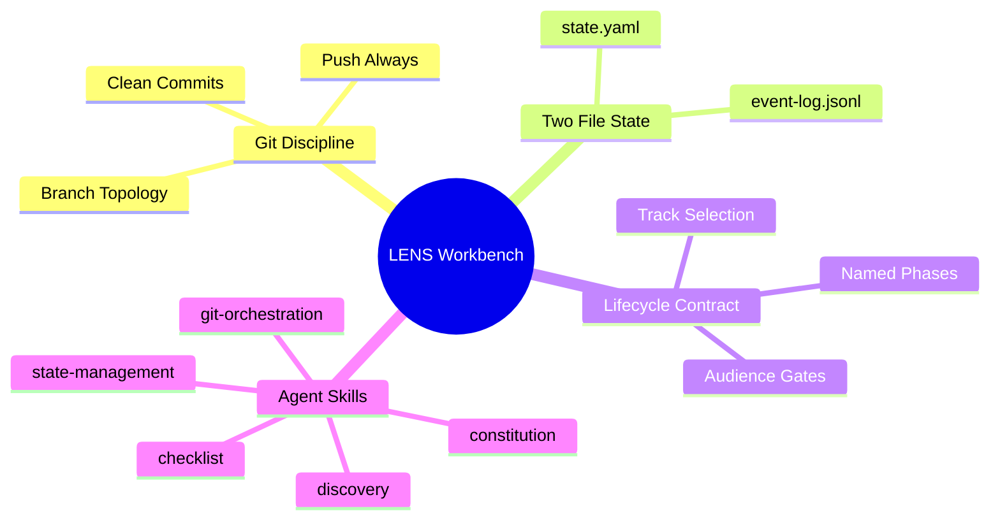

---

## Architecture

### System Architecture

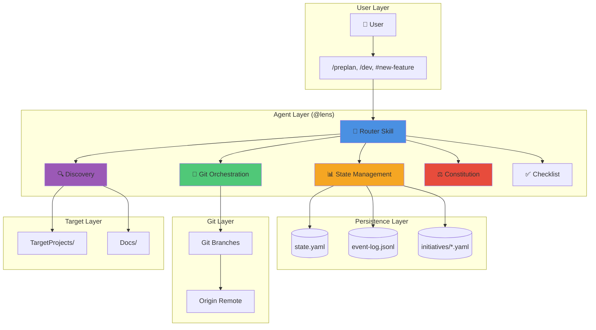

### Two-File State Architecture

LENS Workbench maintains all runtime state in exactly two files:

```
_bmad-output/lens-work/
├── state.yaml          ← Current initiative context (where are we now?)
└── event-log.jsonl     ← Append-only audit trail (what happened?)
```

#### state.yaml Structure

```yaml
active_initiative: bmaddomain-lens-rate-limit-x7k2m9
current_phase: devproposal
current_audience: medium
current_track: feature
current_workflow: epic-breakdown
workflow_step: 3
gate_status:
  small_to_medium: passed
  medium_to_large: pending
branch_state:
  current_branch: bmaddomain-lens-rate-limit-x7k2m9-medium-devproposal
  phase_branch_created: true
  remote_synced: true
last_updated: 2026-02-25T14:32:00Z
```

#### event-log.jsonl Structure

Each line is a timestamped JSON event:

```jsonl
{"timestamp":"2026-02-25T14:00:00Z","event":"initiative_created","initiative_id":"bmaddomain-lens-rate-limit-x7k2m9","layer":"feature","domain":"bmaddomain","service":"lens","tracker_id":"JIRA-1234"}
{"timestamp":"2026-02-25T14:05:00Z","event":"phase_started","phase":"preplan","audience":"small","agent":"mary"}
{"timestamp":"2026-02-25T14:32:00Z","event":"workflow_completed","workflow":"brainstorm","artifacts_generated":["brainstorm-notes.md"]}
{"timestamp":"2026-02-25T15:10:00Z","event":"gate_passed","gate":"small_to_medium","reviewer":"@lens"}
```

### Git Branch Topology

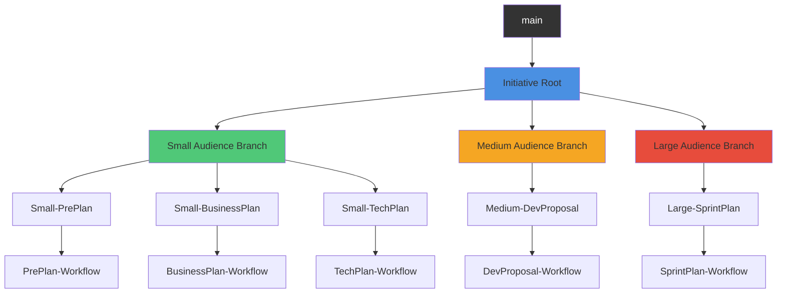

#### Branch Naming Convention

**Feature/Repo Layer (full topology):**
```
{domain_prefix}-{service_prefix}-{initiative_id}                      ← Root
{domain_prefix}-{service_prefix}-{initiative_id}-small                ← Small audience
{domain_prefix}-{service_prefix}-{initiative_id}-small-preplan        ← PrePlan phase
{domain_prefix}-{service_prefix}-{initiative_id}-small-preplan-brainstorm  ← Workflow
{domain_prefix}-{service_prefix}-{initiative_id}-medium               ← Medium audience
{domain_prefix}-{service_prefix}-{initiative_id}-large                ← Large audience
{domain_prefix}-{service_prefix}-{initiative_id}-base                 ← Execution
```

**Domain Layer (single branch):**
```
{domain_prefix}                                                        ← Domain root ONLY
```

**Service Layer (single branch):**
```
{domain_prefix}-{service_prefix}                                       ← Service root ONLY
```

### Skill Responsibility Matrix

| Skill | Role | Trigger | Responsibility |
|-------|------|---------|----------------|
| **@lens** (router) | Phase Router | User commands | Routes phase commands, manages tracks, context switches, audience promotions |
| **git-orchestration** | Git Conductor | Auto-triggered | Creates/validates branches, commits state, pushes to remote — never invoked directly by users |
| **state-management** | State Manager | User shortcodes | Reads/writes `state.yaml`, manages recovery, provides status, handles overrides and archival |
| **discovery** | Discovery Lead | User commands | Bootstraps repos, runs discovery scans, generates canonical docs, reconciles repo inventory |
| **constitution** | Constitutional Guardian | Auto-triggered | 4-level governance (org/domain/service/repo), track enforcement, compliance checks |
| **checklist** | Checklist Manager | Auto-triggered | Progressive phase gate checklists, requirement tracking |

---

## Lifecycle System

### Phase & Audience Model

```mermaid
graph LR
    subgraph "Small Audience (IC Creation)"
        PP[PrePlan<br/>Mary/Analyst] --> BP[BusinessPlan<br/>John/PM + Sally/UX]
        BP --> TP[TechPlan<br/>Winston/Architect]
    end
    
    subgraph "Gate 1"
        G1{Adversarial<br/>Review<br/>Party Mode}
    end
    
    subgraph "Medium Audience (Lead Review)"
        DP[DevProposal<br/>John/PM]
    end
    
    subgraph "Gate 2"
        G2{Stakeholder<br/>Approval}
    end
    
    subgraph "Large Audience (Stakeholder)"
        SP[SprintPlan<br/>Bob/SM]
    end
    
    subgraph "Gate 3"
        G3{Constitution<br/>Gate<br/>@lens}
    end
    
    subgraph "Base (Execution)"
        Dev[Dev<br/>Dev Team]
    end
    
    TP --> G1
    G1 -->|Pass| DP
    DP --> G2
    G2 -->|Pass| SP
    SP --> G3
    G3 -->|Pass| Dev
    
    style PP fill:#9b59b6
    style BP fill:#9b59b6
    style TP fill:#9b59b6
    style DP fill:#3498db
    style SP fill:#e74c3c
    style Dev fill:#27ae60
    style G1 fill:#f39c12
    style G2 fill:#f39c12
    style G3 fill:#f39c12
```

### Named Phases

| Phase | Agent | Audience | Key Artifacts | Description |
|-------|-------|----------|---------------|-------------|
| **PrePlan** | Mary/Analyst | small | brainstorm-notes, product-brief, research | Analysis — brainstorm, research, product brief, project documentation |
| **BusinessPlan** | John/PM + Sally/UX | small | PRD, UX design | Business planning — PRD creation/validation, UX design |
| **TechPlan** | Winston/Architect | small | Architecture, tech decisions, API contracts | Technical design — architecture document, technical decisions |
| **DevProposal** | John/PM | medium | Epics, stories, readiness checklist | Development proposal — break down into implementable units |
| **SprintPlan** | Bob/SM | large | Sprint plan, story assignments | Sprint planning — team capacity, story selection, commitment |
| **Dev** | Dev Team | base | Code, tests, deployments | Sprint execution, code review, retro cycles |

### Initiative Tracks

Tracks control which phases are required (defined in `lifecycle.yaml`):

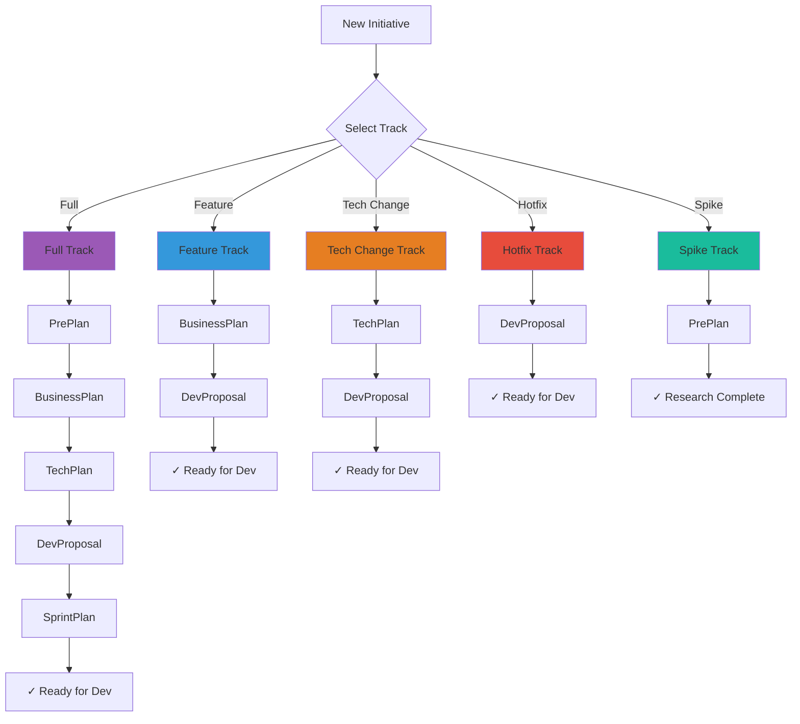

**Track Details:**

| Track | Phases | Use Case | Typical Duration |
|-------|--------|----------|------------------|
| `full` | preplan → businessplan → techplan → devproposal → sprintplan | New product/major initiative | 4-8 weeks |
| `feature` | businessplan → devproposal | Feature addition | 1-3 weeks |
| `tech-change` | techplan → devproposal | Technical migration/upgrade | 2-4 weeks |
| `hotfix` | devproposal only | Critical bug fix | 1-3 days |
| `spike` | preplan only | Research/exploration | 1-2 weeks |

### Audience Promotion Gates

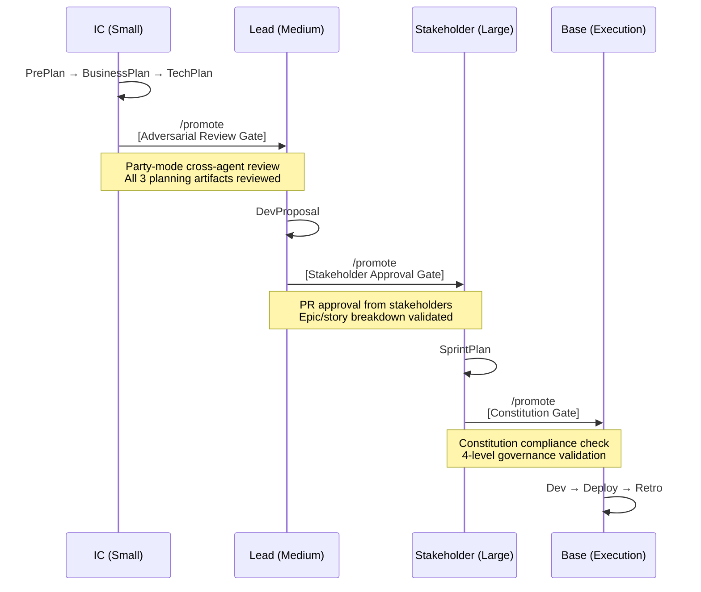

---

## Workflow Catalog

### Initiative Creation Workflows

#### New Feature Flow

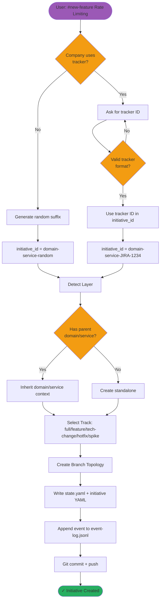

#### New Domain Flow

```mermaid
flowchart TD
    Start([User: #new-domain Payment Platform]) --> ValidateName{Valid<br/>domain name?}
    
    ValidateName -->|No| AskAgain[Request valid name]
    AskAgain --> ValidateName
    ValidateName -->|Yes| CheckConflict{Domain<br/>already exists?}
    
    CheckConflict -->|Yes| Error[Error: Duplicate domain]
    CheckConflict -->|No| CreatePrefix[Generate domain_prefix]
    
    CreatePrefix --> CreateBranch[Create single domain branch:<br/>{domain_prefix}]
    
    CreateBranch --> CreateDomainYAML[Create Domain.yaml with metadata]
    CreateDomainYAML --> ScaffoldFolders[Scaffold: initiatives/, TargetProjects/, Docs/]
    
    ScaffoldFolders --> WriteState[Update state.yaml]
    WriteState --> LogEvent[Log domain_created event]
    LogEvent --> CommitPush[Git commit + push]
    CommitPush --> End([✓ Domain Created])
    
    style Start fill:#9b59b6
    style End fill:#27ae60
    style Error fill:#e74c3c
```

#### New Service Flow

```mermaid
flowchart TD
    Start([User: #new-service Auth Service]) --> LoadDomain{Active domain<br/>in state?}
    
    LoadDomain -->|Yes| UseDomain[Use active domain]
    LoadDomain -->|No| AutoDetect{Domain branches<br/>exist?}
    
    AutoDetect -->|One| UseDetected[Use detected domain]
    AutoDetect -->|Multiple| AskUser[Ask user to select domain]
    AutoDetect -->|None| Error[Error: No domain exists]
    
    UseDomain --> ValidateName{Valid<br/>service name?}
    UseDetected --> ValidateName
    AskUser --> ValidateName
    
    ValidateName -->|No| AskAgain[Request valid name]
    AskAgain --> ValidateName
    ValidateName -->|Yes| CreatePrefix[Generate service_prefix:<br/>{domain_prefix}-{service}]
    
    CreatePrefix --> CreateBranch[Create single service branch]
    CreateBranch --> CreateServiceYAML[Create Service.yaml]
    CreateServiceYAML --> ScaffoldFolders[Scaffold: initiatives/, TargetProjects/, Docs/]
    
    ScaffoldFolders --> WriteState[Update state.yaml]
    WriteState --> LogEvent[Log service_created event]
    LogEvent --> CommitPush[Git commit + push]
    CommitPush --> End([✓ Service Created])
    
    style Start fill:#9b59b6
    style End fill:#27ae60
    style Error fill:#e74c3c
```

### Phase Routing Workflows

#### PrePlan Phase Flow

```mermaid
flowchart TD
    Start([User: /preplan]) --> Preflight[Preflight Check:<br/>- Clean working dir<br/>- state.yaml exists<br/>- Valid initiative]
    
    Preflight --> LoadState[Load state.yaml + initiative config]
    LoadState --> DetermineBranch[Determine phase branch:<br/>{initiative_root}-small-preplan]
    
    DetermineBranch --> BranchExists{Branch<br/>exists?}
    BranchExists -->|No| CreateBranch[Create phase branch]
    BranchExists -->|Yes| CheckoutBranch[Checkout phase branch]
    CreateBranch --> CheckoutBranch
    
    CheckoutBranch --> PromptUser[Invoke Mary/Analyst]
    
    PromptUser --> Brainstorm[Workflow 1: Brainstorm]
    Brainstorm --> Research[Workflow 2: Research]
    Research --> ProductBrief[Workflow 3: Product Brief]
    
    ProductBrief --> GenerateArtifacts[Generate artifacts in<br/>_bmad-output/planning-artifacts/]
    
    GenerateArtifacts --> UpdateState[Update state.yaml:<br/>phase=preplan, workflow=complete]
    UpdateState --> LogEvent[Log phase_completed event]
    LogEvent --> CommitPush[Git commit + push]
    
    CommitPush --> CreatePR{Create PR?}
    CreatePR -->|Yes| OpenPR[Create PR:<br/>small-preplan → small]
    CreatePR -->|No| End
    OpenPR --> End([✓ PrePlan Complete])
    
    style Start fill:#9b59b6
    style End fill:#27ae60
    style Brainstorm fill:#3498db
    style Research fill:#3498db
    style ProductBrief fill:#3498db
```

#### Dev Phase Flow (Sprint Execution)

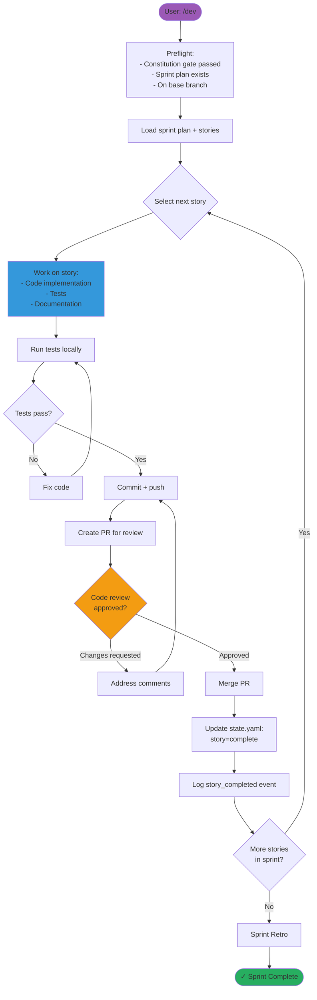

### Discovery Workflows

#### Repo Discovery Flow

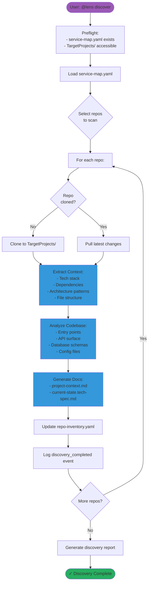

### Utility Workflows

#### Context Switch Flow

```mermaid
flowchart TD
    Start([User: /switch OR @lens /switch]) --> CheckClean{Working dir<br/>clean?}
    
    CheckClean -->|No| PromptCommit[Prompt: Commit or stash changes]
    PromptCommit --> CheckClean
    CheckClean -->|Yes| LoadState[Load state.yaml + initiatives]
    
    LoadState --> ListInitiatives[List active initiatives:<br/>1. initiative-A (DevProposal)<br/>2. initiative-B (TechPlan)<br/>3. initiative-C (Dev)]
    
    ListInitiatives --> UserSelect{User selects<br/>initiative}
    
    UserSelect --> LoadInitiative[Load selected initiative config]
    LoadInitiative --> DetermineBranch[Determine current phase branch]
    
    DetermineBranch --> CheckoutBranch[Checkout phase branch]
    CheckoutBranch --> UpdateState[Update state.yaml:<br/>active_initiative = selected]
    
    UpdateState --> LogEvent[Log context_switched event]
    LogEvent --> Confirm[Confirm to user:<br/>Now on: {initiative} | {phase} | {branch}]
    
    Confirm --> End([✓ Context Switched])
    
    style Start fill:#9b59b6
    style End fill:#27ae60
    style UserSelect fill:#f39c12
```

#### State Sync Flow

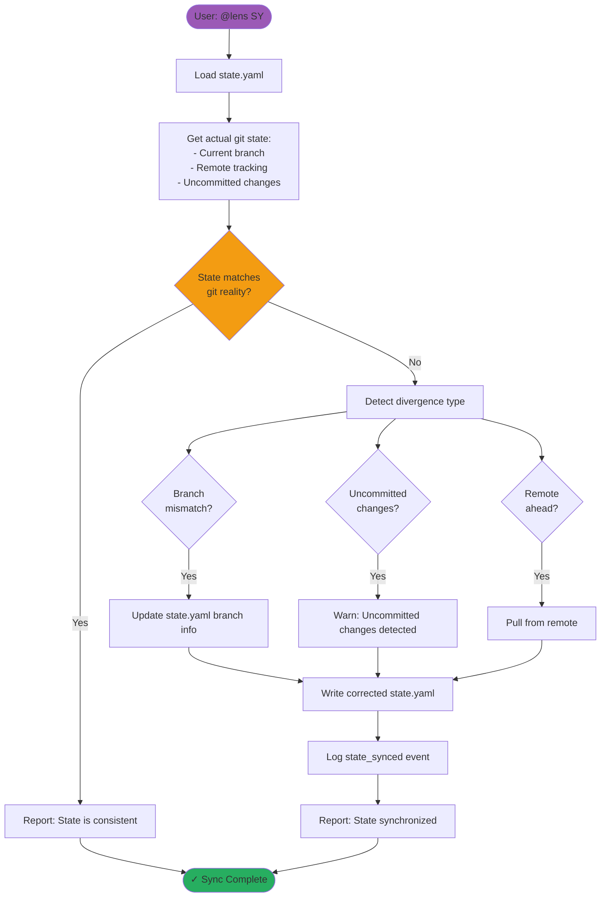

---

## Command Reference

### Phase Router Commands (@lens)

| Command | Phase | Audience | Agent | Description | Aliases |
|---------|-------|----------|-------|-------------|---------|
| `/preplan` | PrePlan | small | Mary/Analyst | Brainstorm, research, product brief | `/pre-plan` |
| `/businessplan` | BusinessPlan | small | John/PM + Sally/UX | PRD, UX design | `/spec` |
| `/techplan` | TechPlan | small | Winston/Architect | Architecture, tech decisions, API contracts | `/tech-plan` |
| `/promote` | — | — | @lens | Audience promotion gate | — |
| `/devproposal` | DevProposal | medium | John/PM | Epics, stories, readiness checklist | `/plan` |
| `/sprintplan` | SprintPlan | large | Bob/SM | Sprint planning, story selection | `/review` |
| `/dev` | Dev | base | Dev Team | Sprint execution, code review, retro | — |

### Context Commands (@lens)

| Command | Description | Output Example |
|---------|-------------|----------------|
| `/switch` | Switch context — initiative, lens, phase, or size | Interactive selection menu |
| `/context` | Display current context | `rate-limit-x7k2m9 \| DevProposal \| medium \| track:feature` |
| `/constitution` | Display operating rules and compliance constraints | 4-level constitution hierarchy display |
| `/lens` | Show or change the current lens focus | Current lens + available lenses |

### Initiative Commands (@lens)

| Command | Layer | Description | Example |
|---------|-------|-------------|---------|
| `/new-domain` | Domain | Create domain-level initiative | `/new-domain Payment Platform` |
| `/new-service` | Service | Create service-level initiative | `/new-service Auth Service` |
| `/new-feature` | Feature | Create feature-level initiative | `/new-feature Rate Limiting` |
| `#fix-story` | Any | Correction loop — fix failed story | `#fix-story story-123` |

### State & Recovery Commands (@lens)

| Shortcode | Skill | Description | Use When |
|-----------|-------|-------------|----------|
| `?` | state-management | Quick status — one-line summary | Quick context check |
| `ST` | state-management | Full status — detailed initiative/phase/gate/branch info | Detailed inspection needed |
| `RS` | state-management | Resume — pick up where you left off | Interrupted workflow |
| `SY` | state-management | Sync — reconcile state with git | State/git mismatch suspected |
| `FX` | state-management | Fix state — repair corrupted state | State file corruption |
| `OR` | state-management | Override — manually set state values | Advanced manual intervention |
| `AR` | state-management | Archive — archive completed initiatives | Initiative complete/abandoned |

### Discovery Commands (@lens)

| Command | Description | Outputs | When to Use |
|---------|-------------|---------|-------------|
| `onboard` | First-time setup — create profile, bootstrap repos | profile.yaml, service-map.yaml | Initial BMAD setup |
| `bootstrap` | Re-run bootstrap for new/changed repos | Bootstrap report | New repos added |
| `discover` | Deep scan repos for tech stack, structure, patterns | repo-inventory.yaml | Before planning work |
| `document` | Generate canonical docs from discovery | Docs/{domain}/{service}/ | After discovery scan |
| `reconcile` | Reconcile repo inventory with service-map | Updated service-map.yaml | After adding/removing repos |
| `repo-status` | Check health/status of all managed repos | Status report | Routine health check |

---

## Flow Diagrams

### Complete Initiative Lifecycle

```mermaid
graph TB
    Start([Create Initiative]) --> SelectLayer{Select Layer}
    
    SelectLayer -->|Domain| DomainInit[#new-domain<br/>Single branch only]
    SelectLayer -->|Service| ServiceInit[#new-service<br/>Single branch only]
    SelectLayer -->|Feature| FeatureInit[#new-feature<br/>Full topology]
    
    DomainInit --> DomainDone([Domain Created<br/>No phases])
    ServiceInit --> ServiceDone([Service Created<br/>No phases])
    
    FeatureInit --> SelectTrack{Select Track}
    
    SelectTrack -->|Full| TrackFull[full track]
    SelectTrack -->|Feature| TrackFeature[feature track]
    SelectTrack -->|Tech Change| TrackTech[tech-change track]
    SelectTrack -->|Hotfix| TrackHotfix[hotfix track]
    SelectTrack -->|Spike| TrackSpike[spike track]
    
    TrackFull --> PrePlan[/preplan<br/>PrePlan Phase]
    PrePlan --> BusinessPlan[/businessplan<br/>BusinessPlan Phase]
    
    TrackFeature --> BusinessPlan
    
    BusinessPlan --> TechPlan[/techplan<br/>TechPlan Phase]
    
    TrackTech --> TechPlan
    TrackSpike --> PrePlan2[/preplan<br/>PrePlan Phase]
    PrePlan2 --> SpikeDone([Spike Complete])
    
    TechPlan --> Gate1[/promote<br/>Adversarial Review Gate]
    Gate1 --> DevProposal[/devproposal<br/>DevProposal Phase]
    
    TrackHotfix --> DevProposal
    
    DevProposal --> Gate2[/promote<br/>Stakeholder Approval Gate]
    Gate2 --> SprintPlan[/sprintplan<br/>SprintPlan Phase]
    
    SprintPlan --> Gate3[/promote<br/>Constitution Gate]
    Gate3 --> Dev[/dev<br/>Dev Phase]
    
    Dev --> Sprint{Sprint<br/>Complete?}
    Sprint -->|More work| Dev
    Sprint -->|Done| Archive[Archive Initiative]
    Archive --> Done([✓ Initiative Complete])
    
    style Start fill:#9b59b6
    style DomainDone fill:#27ae60
    style ServiceDone fill:#27ae60
    style SpikeDone fill:#27ae60
    style Done fill:#27ae60
    style Gate1 fill:#f39c12
    style Gate2 fill:#f39c12
    style Gate3 fill:#f39c12
```

### Git Discipline Workflow

Every workflow that mutates state follows this pattern:

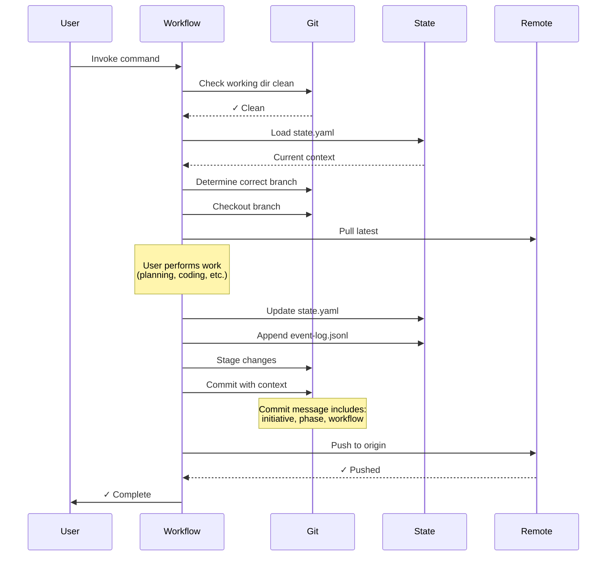

### Constitution Hierarchy

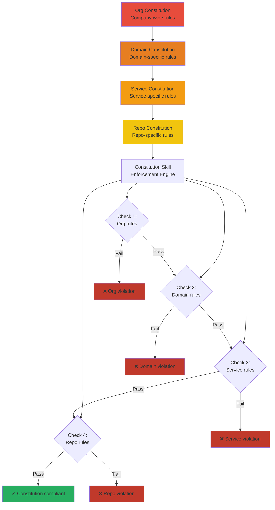

---

## Examples & Tutorials

### Tutorial 1: Creating Your First Feature

**Scenario:** You're adding a rate limiting feature to the lens-work service.

#### Step 1: Create the initiative

```bash
# Invoke in Copilot Chat or terminal
@lens /new-feature Rate Limiting
```

**What happens:**
1. @lens prompts for tracker ID (if company uses Jira/ADO): `JIRA-1234`
2. Auto-detects layer = feature, domain = bmaddomain, service = lens
3. Generates `initiative_id` = `bmaddomain-lens-JIRA-1234`
4. Prompts for track selection → Choose `feature`
5. Creates branch topology:
   - `bmaddomain-lens-JIRA-1234` (root)
   - `bmaddomain-lens-JIRA-1234-small` (small audience)
   - `bmaddomain-lens-JIRA-1234-medium` (medium audience)
   - `bmaddomain-lens-JIRA-1234-large` (large audience)
   - `bmaddomain-lens-JIRA-1234-base` (execution)
6. Writes `state.yaml` and `initiatives/bmaddomain-lens-JIRA-1234.yaml`
7. Logs `initiative_created` event
8. Commits + pushes

**Output:**
```
✓ Initiative created: bmaddomain-lens-JIRA-1234
  Layer: feature | Domain: bmaddomain | Service: lens
  Track: feature (businessplan → devproposal)
  Tracker: JIRA-1234
  Branches created: 5
  Current branch: bmaddomain-lens-JIRA-1234-small
```

#### Step 2: Start planning (BusinessPlan phase)

```bash
@lens /businessplan
```

**What happens:**
1. Preflight check: clean working dir, valid initiative, state exists
2. Creates phase branch: `bmaddomain-lens-JIRA-1234-small-businessplan`
3. Checks out phase branch
4. Invokes John/PM + Sally/UX
5. Guided through:
   - PRD creation (problem statement, user stories, acceptance criteria)
   - UX design (mockups, user flows, interaction patterns)
6. Generates artifacts in `_bmad-output/planning-artifacts/JIRA-1234/`
7. Updates `state.yaml`: `current_phase=businessplan, current_workflow=complete`
8. Logs `phase_completed` event
9. Commits + pushes
10. Optionally creates PR: `businessplan → small`

**Output:**
```
✓ BusinessPlan phase complete
  Artifacts generated:
    - PRD.md
    - UX-design.md
  PR created: #42 (bmaddomain-lens-JIRA-1234-small-businessplan → small)
```

#### Step 3: Technical planning (TechPlan phase)

```bash
@lens /techplan
```

**What happens:**
1. Creates phase branch: `bmaddomain-lens-JIRA-1234-small-techplan`
2. Invokes Winston/Architect
3. Guided through:
   - Architecture design
   - Technical decisions (patterns, libraries, approaches)
   - API contracts
4. Generates artifacts
5. Updates state + logs event
6. Commits + pushes

#### Step 4: Promote to medium audience

```bash
@lens /promote
```

**What happens:**
1. Detects current audience = small, target = medium
2. Triggers Gate 1: Adversarial Review (party mode)
3. Cross-agent review of PRD, UX, Architecture
4. If passed: updates `state.yaml`: `current_audience=medium, gate_status.small_to_medium=passed`
5. Checks out `bmaddomain-lens-JIRA-1234-medium` branch
6. Logs `audience_promoted` event

**Output:**
```
✓ Adversarial Review Gate passed
  Promoted: small → medium
  Current branch: bmaddomain-lens-JIRA-1234-medium
  Next phase: /devproposal
```

#### Step 5: Development proposal

```bash
@lens /devproposal
```

**What happens:**
1. Creates phase branch: `bmaddomain-lens-JIRA-1234-medium-devproposal`
2. Invokes John/PM
3. Guided through:
   - Epic breakdown
   - Story creation
   - Readiness checklist
4. Generates epics/stories in `_bmad-output/planning-artifacts/JIRA-1234/epics/`
5. Updates state + logs event
6. Commits + pushes

#### Step 6: Promote to large audience

```bash
@lens /promote
```

Gate 2: Stakeholder Approval

#### Step 7: Sprint planning

```bash
@lens /sprintplan
```

**What happens:**
1. Creates phase branch: `bmaddomain-lens-JIRA-1234-large-sprintplan`
2. Invokes Bob/SM
3. Guided through:
   - Team capacity assessment
   - Story selection
   - Sprint commitment
4. Generates sprint plan
5. Updates state + logs event

#### Step 8: Promote to base (constitution gate)

```bash
@lens /promote
```

Gate 3: Constitution Gate (4-level compliance check)

#### Step 9: Sprint execution

```bash
@lens /dev
```

**What happens:**
1. Checks out `bmaddomain-lens-JIRA-1234-base` branch
2. Invokes Dev Team
3. Sprint execution loop:
   - Select story
   - Implement code
   - Write tests
   - Create PR
   - Code review
   - Merge
   - Repeat
4. Updates state for each story completion

#### Step 10: Archive completed initiative

```bash
@lens AR
```

**Output:**
```
✓ Initiative archived: bmaddomain-lens-JIRA-1234
  Status: complete
  Duration: 3 weeks
  Stories completed: 12
  PRs merged: 15
```

---

### Tutorial 2: Setting Up a New Domain

**Scenario:** Your org is starting a new Payment Platform domain.

```bash
# Step 1: Create domain
@lens /new-domain Payment Platform

# Output:
# ✓ Domain created: paymentplatform
#   Branch: paymentplatform (single branch only)
#   Domain.yaml created
#   Folders: initiatives/, TargetProjects/, Docs/

# Step 2: Create a service within the domain
@lens /new-service Transaction Service

# @lens auto-detects parent domain from state
# Output:
# ✓ Service created: paymentplatform-transaction
#   Branch: paymentplatform-transaction (single branch only)
#   Service.yaml created
#   Folders: initiatives/, TargetProjects/, Docs/

# Step 3: Create a feature within the service
@lens /new-feature Idempotency Keys

# Output:
# ✓ Feature created: paymentplatform-transaction-idempotency-x9k3p2
#   Full branch topology created (5 branches)
#   Track: feature
#   Ready for /businessplan
```

---

### Tutorial 3: Recovering from Interruption

**Scenario:** You were working on a feature but got interrupted mid-workflow.

```bash
# Quick check: where was I?
@lens ?
# Output: paymentplatform-transaction-idempotency-x9k3p2 | BusinessPlan | small | workflow:prd | step:3/5

# Full status
@lens ST
# Output:
# Initiative: paymentplatform-transaction-idempotency-x9k3p2
# Layer: feature | Track: feature
# Current Phase: BusinessPlan
# Current Audience: small
# Current Workflow: prd
# Workflow Step: 3/5 (User stories)
# Branch: paymentplatform-transaction-idempotency-x9k3p2-small-businessplan
# Gate Status:
#   - small_to_medium: pending
#   - medium_to_large: pending
#   - large_to_base: pending
# Last Event: workflow_step_completed (2026-02-25T14:32:00Z)

# Resume workflow
@lens RS
# Output:
# ✓ Resuming BusinessPlan phase, workflow: prd, step: 3/5
#   Continuing: User stories (acceptance criteria)
```

---

### Tutorial 4: Switching Between Initiatives

**Scenario:** You're working on multiple features and need to switch context.

```bash
# Current initiative
@lens ?
# Output: rate-limit-x7k2m9 | DevProposal | medium

# Switch to another initiative
@lens /switch

# Output (interactive):
# Active Initiatives:
#   1. rate-limit-x7k2m9 (DevProposal - medium)
#   2. idempotency-x9k3p2 (BusinessPlan - small)
#   3. auth-refactor-b3j1 (TechPlan - small)
# Select: 2

# @lens switches context
✓ Context switched to: idempotency-x9k3p2
  Phase: BusinessPlan | Audience: small
  Branch: paymentplatform-transaction-idempotency-x9k3p2-small-businessplan

# Verify
@lens /context
# Output: idempotency-x9k3p2 | BusinessPlan | small | track:feature
```

---

## Installation & Configuration

### Installation

```bash
# From BMAD control repo root
bmad install lens-work
```

**OR** manual installation:

```bash
# Clone lens-work module
git clone https://github.com/crisweber2600/bmad.lens.release _bmad/lens-work

# Run installer
node _bmad/lens-work/_module-installer/installer.js
```

### Configuration

During installation, you'll be prompted for:

| Setting | Description | Default | Example |
|---------|-------------|---------|---------|
| `target_projects_path` | Path to TargetProjects folder | `../TargetProjects` | `../repos` |
| `docs_output_path` | Path for canonical docs | `Docs` | `documentation` |
| `enable_telemetry` | Enable dashboards | `true` | `true` |
| `default_git_remote` | Git remote type | `github` | `github` / `gitlab` / `azdo` |
| `tracker_type` | Work item tracker | `none` | `jira` / `azdo` / `csv` |
| `tracker_url` | Tracker base URL | `` | `https://mycompany.atlassian.net` |

### Post-Installation

1. **Onboard:** Run onboarding to create profile and bootstrap repos
   ```bash
   @lens onboard
   ```

2. **Discovery:** Scan existing repos
   ```bash
   @lens discover
   @lens document
   ```

3. **Create First Initiative:**
   ```bash
   @lens /new-feature My First Feature
   ```

### Configuration Files

**Module Configuration:** `_bmad/lens-work/bmadconfig.yaml`

```yaml
project_name: my-control-repo
user_skill_level: intermediate
planning_artifacts: "{project-root}/_bmad-output/planning-artifacts"
implementation_artifacts: "{project-root}/_bmad-output/implementation-artifacts"
project_knowledge: "{project-root}/docs"
user_name: YourName
communication_language: English
document_output_language: English
output_folder: "{project-root}/_bmad-output"
```

**Service Map:** `_bmad/lens-work/service-map.yaml`

```yaml
target_projects_path: ../TargetProjects
docs_output_path: Docs

repos:
  - name: my-service
    remote_url: https://github.com/myorg/my-service
    local_path: TargetProjects/my-domain/my-service
    default_branch: main
    domain: my-domain
    service: my-domain
```

**User Profile:** `_bmad-output/lens-work/personal/profile.yaml`

```yaml
name: YourName
email: you@example.com
role: Developer
team: Platform Team
tracker:
  type: jira
  url: https://mycompany.atlassian.net
  project_key: PROJ
preferences:
  default_track: feature
  auto_create_prs: true
  party_mode_on_promote: true
```

---

## Troubleshooting

### Common Issues

#### Issue 1: "Uncommitted changes detected"

**Problem:** Workflow refuses to run due to uncommitted changes.

**Solution:**
```bash
# Check git status
git status

# Commit changes
git add .
git commit -m "WIP: current work"

# Or stash
git stash

# Then retry workflow
@lens /businessplan
```

---

#### Issue 2: State file corruption

**Problem:** `state.yaml` shows incorrect phase or branch.

**Solution:**
```bash
# Sync state with git
@lens SY

# If sync fails, fix state manually
@lens FX

# Verify
@lens ST
```

---

#### Issue 3: Branch not created

**Problem:** Phase command fails because phase branch doesn't exist.

**Solution:**
```bash
# Check current branch
git branch

# Manually create phase branch (if needed)
initiative_root="bmaddomain-lens-rate-limit-x7k2m9"
phase="businessplan"
audience="small"
git checkout -b "${initiative_root}-${audience}-${phase}"
git push -u origin "${initiative_root}-${audience}-${phase}"

# Update state
@lens OR
# Set: current_branch = {new branch name}
```

---

#### Issue 4: Gate fails unexpectedly

**Problem:** Promotion gate fails without clear reason.

**Solution:**
```bash
# Check constitution compliance
@lens /constitution

# Review gate requirements
@lens ST

# Check event log for gate failure reason
cat _bmad-output/lens-work/event-log.jsonl | grep gate_failed | tail -1

# If gate is incorrectly failed, manually override (use caution)
@lens OR
# Set: gate_status.small_to_medium = passed
```

---

#### Issue 5: Wrong initiative context

**Problem:** Working on wrong initiative after context switch.

**Solution:**
```bash
# Check current context
@lens ?

# Switch to correct initiative
@lens /switch
# Select correct initiative from menu

# Verify
@lens /context
```

---

#### Issue 6: Discovery fails to clone repo

**Problem:** Discovery workflow fails when cloning a repo.

**Solution:**
```bash
# Check service-map.yaml for correct remote URL
cat _bmad/lens-work/service-map.yaml

# Verify git credentials
git config --list | grep credential

# Manually clone to diagnose
git clone <remote_url> TargetProjects/<path>

# Update service-map.yaml if URL is wrong
# Then re-run discovery
@lens discover
```

---

### Debug Mode

Enable verbose logging for troubleshooting:

```bash
# Set environment variable
export BMAD_DEBUG=true

# Run workflow with debug output
@lens /businessplan

# Check logs
cat _bmad-output/lens-work/debug.log
```

---

### Getting Help

1. **Command Help:**
   ```bash
   @lens help
   @lens help /businessplan
   ```

2. **Status Check:**
   ```bash
   @lens ST
   ```

3. **Event Log Analysis:**
   ```bash
   # View last 10 events
   tail -10 _bmad-output/lens-work/event-log.jsonl | jq .
   
   # Search for specific events
   grep "initiative_created" _bmad-output/lens-work/event-log.jsonl
   ```

4. **Community Support:**
   - GitHub Issues: https://github.com/crisweber2600/bmad.lens.release/issues
   - Documentation: https://docs.bmad-method.org/

---

## File Structure Reference

```
lens-work/
├── bmadconfig.yaml                      # Module configuration
├── lifecycle.yaml                       # Lifecycle contract (phases, audiences, tracks)
├── service-map.yaml                     # Target repo mapping
├── README.md                            # Quick reference
├── README-COMPREHENSIVE.md              # This file
│
├── skills/                              # @lens agent skill definitions
│   ├── checklist.md                     # Progressive phase gate checklists
│   ├── constitution.md                  # Inline governance checks
│   ├── discovery.md                     # Repo scanning & doc generation
│   ├── git-orchestration.md             # Branch operations & git discipline
│   └── state-management.md             # Two-file state system management
│
├── workflows/
│   ├── router/                          # Phase router commands (user-facing)
│   ├── core/                            # Auto-triggered lifecycle operations
│   ├── discovery/                       # Repo discovery & documentation
│   ├── governance/                      # Constitution & compliance
│   ├── utility/                         # Manual/support workflows
│   ├── background/                      # Background processes
│   └── includes/                        # Shared reference files
│
├── prompts/                             # Copilot Chat prompt stubs
├── lib/                                 # JavaScript implementation modules
├── scripts/                             # Validation & utility scripts
├── tests/                               # Test specifications
├── docs/                                # Extended documentation
│
└── _bmad-output/
    └── lens-work/
        ├── state.yaml                   # Current state (active initiative, phase, audience)
        ├── event-log.jsonl              # Append-only event audit trail
        ├── repo-inventory.yaml          # Discovered repo metadata
        ├── initiatives/                 # Per-initiative configs
        ├── dashboards/                  # Telemetry data
        └── personal/
            └── profile.yaml             # User profile & preferences
```

---

## Appendix: Lifecycle Contract Reference

From `lifecycle.yaml`:

### Fundamental Truths

1. **FT1:** Planning artifacts must exist and be reviewed before code is written
2. **FT2:** AI agents must work within disciplined constraints, not freestyle
3. **FT3:** Multi-service initiatives must have coordinated lifecycle governance

### Audiences

| Audience | Role | Phases | Entry Gate |
|----------|------|--------|------------|
| `small` | IC creation work | preplan, businessplan, techplan | — |
| `medium` | Lead review | devproposal | adversarial-review (party mode) |
| `large` | Stakeholder approval | sprintplan | stakeholder-approval |
| `base` | Ready for execution | dev | constitution-gate |

### Tracks

| Track | Phases | Use Case | Typical Duration |
|-------|--------|----------|------------------|
| `full` | preplan → businessplan → techplan → devproposal → sprintplan | New product/major initiative | 4-8 weeks |
| `feature` | businessplan → devproposal | Feature addition | 1-3 weeks |
| `tech-change` | techplan → devproposal | Technical migration/upgrade | 2-4 weeks |
| `hotfix` | devproposal only | Critical bug fix | 1-3 days |
| `spike` | preplan only | Research/exploration | 1-2 weeks |

### Gates

| Gate | From Audience | To Audience | Mechanism | Required For |
|------|---------------|-------------|-----------|--------------|
| `adversarial-review` | small | medium | Party-mode cross-agent review | All tracks except spike |
| `stakeholder-approval` | medium | large | PR approval from stakeholders | All tracks except spike/hotfix |
| `constitution-gate` | large | base | Constitution compliance check (4-level) | All tracks |

---

## Revision History

| Version | Date | Changes |
|---------|------|---------|
| 2.0.0 | 2026-02-25 | Complete rewrite with comprehensive workflows, mermaid diagrams, tutorials |
| 1.0.0 | 2026-02-03 | Initial release |

---

**lens-work** — *Guided lifecycle orchestration for BMAD*

**Maintained by:** CrisWeber  
**License:** MIT  
**Repository:** https://github.com/crisweber2600/bmad.lens.release
