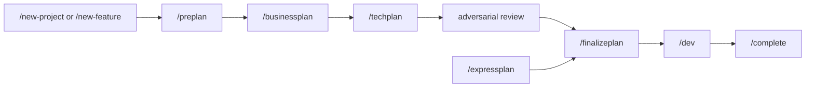
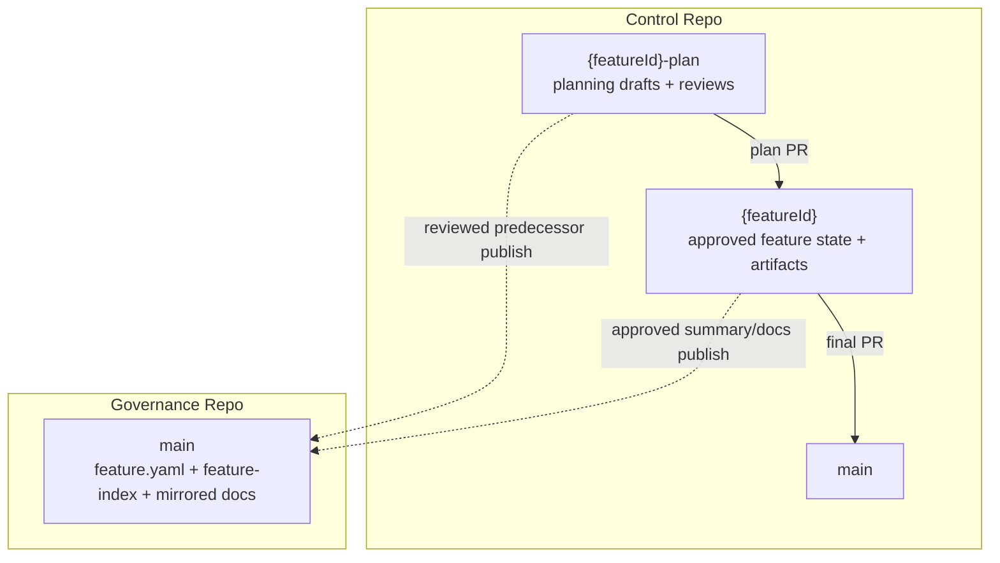
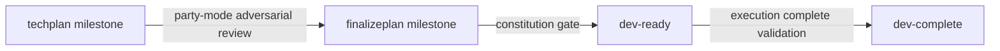

# LENS Workbench — Lifecycle Visual Guide

**Module:** lens-work v4.0  
**Schema Version:** 4  
**Last Updated:** 2026-04-15

This guide visualizes the current Lens lifecycle. It reflects the active **2-branch control-repo model** and the **FinalizePlan** planning handoff.

---

## Full Lifecycle Overview

### What Changed from v3

- `FinalizePlan` replaces the old `DevProposal` plus `SprintPlan` chain.
- The default planning flow uses `{featureId}-plan` rather than milestone branches.
- Governance stays on `main`; approved docs are mirrored there at handoff.

---

## Branch Topology

### Branch Responsibilities

| Branch | Purpose |
|--------|---------|
| `{featureId}-plan` | Draft planning documents and review reports |
| `{featureId}` | Approved feature state and published planning artifacts |
| governance `main` | Canonical portfolio state and mirrored approved docs |

---

## Phase Progression

| Phase | Owner | Branch | Primary Outputs | Next Step |
|-------|-------|--------|-----------------|-----------|
| `preplan` | Mary | plan | `product-brief`, `research`, `brainstorm` | `/businessplan` |
| `businessplan` | John + Sally | plan | `prd`, `ux-design` | `/techplan` |
| `techplan` | Winston | plan | `architecture` | adversarial review, then `/finalizeplan` |
| `finalizeplan` | Lens | plan | `review-report`, `epics`, `stories`, `implementation-readiness`, `sprint-status`, `story-files` | `/dev` |
| `expressplan` | Lens | code | `business-plan`, `tech-plan`, `sprint-plan`, `expressplan-adversarial-review` | `/finalizeplan` |

`/dev` delegates implementation into target repos. `/complete` handles retrospective plus archival after execution is done.

---

## Milestones and Gates

| Milestone | Meaning | Gate |
|-----------|---------|------|
| `techplan` | Early planning complete | adversarial review at phase boundaries |
| `finalizeplan` | Planning bundle complete and ready for implementation handoff | party-mode adversarial review |
| `dev-ready` | Safe to begin implementation | constitution gate |
| `dev-complete` | Optional execution-completion checkpoint | dev-closeout validation |

---

## Track Profiles

| Track | Phases | Start Command | Typical Use |
|-------|--------|---------------|-------------|
| `full` | `preplan -> businessplan -> techplan -> finalizeplan` | `/preplan` | Full planning cycle |
| `feature` | `businessplan -> techplan -> finalizeplan` | `/businessplan` | Known business context |
| `tech-change` | `techplan -> finalizeplan` | `/techplan` | Technical change |
| `hotfix` | `techplan` | `/techplan` | Urgent fix |
| `hotfix-express` | `techplan` | `/techplan` | Expedited critical fix |
| `spike` | `preplan` | `/preplan` | Research only |
| `quickdev` | `finalizeplan` | `/finalizeplan` | Jump directly to implementation packaging |
| `express` | `expressplan -> finalizeplan` | `/expressplan` | Combined planning followed by FinalizePlan review |

---

## Command Reference Matrix

### Planning Commands

| Command | Phase | Branch | Key Outputs |
|---------|-------|--------|-------------|
| `/preplan` | PrePlan | `{featureId}-plan` | product brief, research, brainstorm |
| `/businessplan` | BusinessPlan | `{featureId}-plan` | PRD, UX design |
| `/techplan` | TechPlan | `{featureId}-plan` | architecture |
| `/finalizeplan` | FinalizePlan | `{featureId}-plan` | review report, epics, stories, readiness, sprint status, story files |
| `/expressplan` | ExpressPlan | `{featureId}` | business plan, tech plan, sprint plan, express review |
| `/dev` | Delegation | target repos | code and review artifacts |
| `/complete` | Completion | control repo plus governance | retrospective and archive updates |

### Utility Commands

| Command | Purpose |
|---------|---------|
| `/new-domain`, `/new-service`, `/new-feature`, `/new-project` | Bootstrap lifecycle scope |
| `/target-repo` | Provision or register a target repo |
| `/dashboard` | Report state across features |
| `/next` | Route to the next unblocked action |
| `/batch` | Generate or resume batch intake |
| `/switch` | Change active feature context |
| `/discover` | Reconcile repo inventory with `TargetProjects/` |
| `/retrospective`, `/log-problem` | Capture and analyze execution issues |
| `/move-feature`, `/split-feature` | Reshape feature scope |
| `/approval-status`, `/rollback`, `/profile`, `/module-management` | Operational support surfaces |

---

## Artifact Inventory

| Phase | Artifact | File Pattern |
|-------|----------|--------------|
| PrePlan | Product brief | `product-brief.md` |
| PrePlan | Research | `research.md` |
| PrePlan | Brainstorm | `brainstorm.md` |
| BusinessPlan | PRD | `prd.md` |
| BusinessPlan | UX design | `ux-design.md` |
| TechPlan | Architecture | `architecture.md` |
| FinalizePlan | Review report | `finalizeplan-review.md` |
| FinalizePlan | Epics | `epics.md` |
| FinalizePlan | Stories | `stories.md` |
| FinalizePlan | Implementation readiness | `implementation-readiness.md` |
| FinalizePlan | Sprint status | `sprint-status.yaml` |
| FinalizePlan | Story files | `stories/**` |
| ExpressPlan | Combined planning bundle | `business-plan.md`, `tech-plan.md`, `sprint-plan.md` |

---

## Legacy Note

`DevProposal` and `SprintPlan` are not part of the active v4 lifecycle path. If you encounter those names in old migration or historical docs, treat them as legacy v3 terminology.