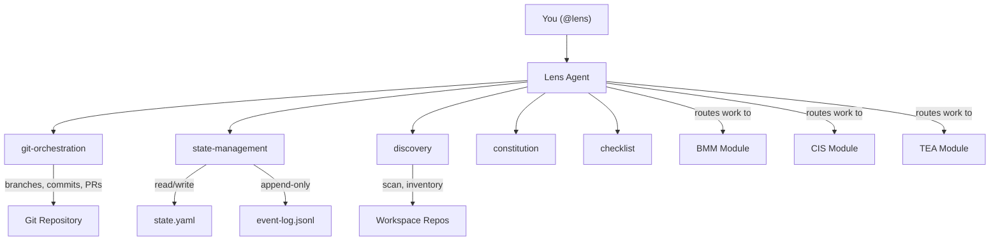
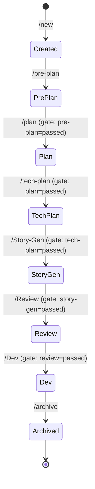
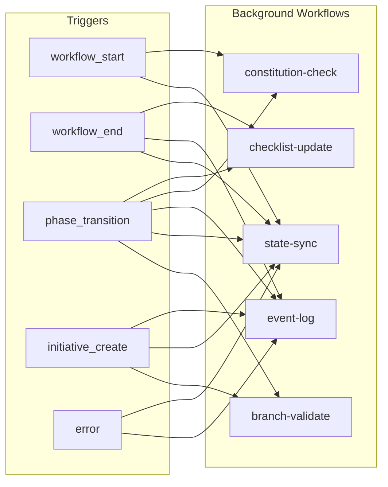

# Lens Architecture

This document explains how Lens works internally — the single-agent design, skill delegation, state management, background automation, and module integration.

## Design Principles

Lens is built on five principles that shape every design decision:

1. **One interface, zero confusion** — You interact with `@lens` and nothing else. Internal delegation is invisible.
2. **Constitution at every step** — Governance checks run automatically at every workflow boundary. You never invoke them manually.
3. **State is sacred** — Every mutation writes to `state.yaml` and appends to `event-log.jsonl`. No state change goes unrecorded.
4. **Git discipline** — Clean working directory before every operation. Targeted commits (only touched files). Push at workflow boundaries, never mid-step.
5. **Progressive disclosure** — `/status` shows a summary. `/lens` shows full detail. Checklists expand only when you ask.

## Single Agent Architecture

Lens uses one agent that delegates to five internal skills:

Each skill has a specific responsibility:

| Skill | Replaces | Responsibility |
|-------|----------|----------------|
| `git-orchestration` | Branch operations | Create branches, validate topology, commit, push, prepare PRs |
| `state-management` | State tracking | Read/write `state.yaml`, append `event-log.jsonl`, dual-write sync |
| `discovery` | Repo scanning | Onboarding, workspace scanning, bootstrapping, documentation |
| `constitution` | Governance | Inline validation at every step, advisory or enforced mode |
| `checklist` | Progress tracking | Generate phase checklists, auto-detect artifacts, gate validation |

Skills are internal — you never invoke them directly. When you run `/pre-plan`, Lens automatically engages `git-orchestration` (to create the phase branch), `state-management` (to update state), `constitution` (to validate rules), and `checklist` (to initialize the phase checklist).

## Initiative Lifecycle

An initiative progresses through a fixed sequence of phases. Each phase has a gate that must pass before the next phase can begin:

Each phase:

1. Creates a phase branch from the appropriate audience branch
2. Runs constitution checks
3. Executes the phase workflow (routing to BMM, CIS, or TEA as needed)
4. Validates required artifacts exist
5. Sets the phase gate to `passed`
6. Creates a PR from the phase branch to the audience branch
7. Merges, deletes the phase branch, and checks out the audience branch

## Two-File State System

Lens tracks state in two files that serve complementary purposes:

### state.yaml — Mutable Current State

Located at `_bmad-output/lens/state.yaml`. Contains the active initiative, current phase, gate statuses, checklist, and workflow status. Updated atomically at workflow boundaries by the `state-management` skill.

This is the file every workflow reads to understand "where are we now." It answers: which initiative, which phase, which branch, what gates have passed.

### event-log.jsonl — Immutable Audit Trail

Located at `_bmad-output/lens/event-log.jsonl`. Append-only log in JSONL format. Every state-changing operation writes an event with timestamp, event type, initiative ID, user, and details.

This file serves two purposes:

- **Audit trail** — See the full history of everything that happened
- **Recovery source** — The `/fix` command reconstructs `state.yaml` from scratch by replaying event-log entries

### Dual-Write Contract

When `gate_status` or `current_phase` changes, the `state-management` skill writes to **both** `state.yaml` *and* the initiative config file (`_bmad-output/lens/initiatives/{id}.yaml`). This keeps the two files synchronized. If they drift, `/sync` detects it and `/fix` resolves it.

## Background Workflows

Five workflows run automatically at lifecycle boundaries. You never invoke them — they trigger based on events:

| Workflow | Purpose |
|----------|---------|
| `state-sync` | Verifies `state.yaml` matches git branch reality. Self-heals drift. |
| `event-log` | Appends a JSONL entry for the completed operation. |
| `branch-validate` | Confirms expected branches exist (root + audiences for features). |
| `constitution-check` | Runs governance rules for the current phase. Advisory warns; enforced blocks. |
| `checklist-update` | Auto-detects generated artifacts and updates checklist status. |

## Module Integration

Lens does not execute lifecycle work itself — it routes to the right BMAD module for each phase:

| Phase | Primary Module | What It Does |
|-------|---------------|--------------|
| Pre-Plan | CIS + BMM | Brainstorming (CIS creative workshopping) then product brief (BMM pre-planning) |
| Plan | BMM | Product requirements: PRD, epics, user stories, acceptance criteria |
| Tech-Plan | BMM | Architecture design: tech decisions, API contracts, infrastructure |
| Story-Gen | BMM | Implementation stories: story generation, estimates, dependency mapping |
| Review | **Lens** (native) | Implementation readiness: all gates, all checklists, constitution scan |
| Dev | BMM | Implementation loop: code, test, PR creation |

The Review phase is the only phase Lens runs internally. All others delegate to external modules. Lens maintains state context across the routing boundary — the target module receives the current phase, initiative details, and constitution results.

### Cross-Module Contract

Lens exposes a contract through `lens_contract_version: "2.0"` in `state.yaml`. Other modules read this to understand:

- Current phase and phase number
- Active initiative details and type
- Gate status across all phases
- Constitution check results
- Audience configuration

Lens passes this context when routing to BMM, CIS, or TEA, so those modules can adapt their workflows based on the initiative's current state.

## Git Workflow

Lens enforces strict git discipline through the `git-orchestration` skill:

- **Clean state** — Every operation starts with `git status` verification
- **Targeted commits** — Only files touched by the current operation are staged
- **Conventional format** — Commit messages follow `[lens] /command: description`
- **Push boundaries** — Pushes happen at workflow end, never mid-step
- **Branch isolation** — Each workflow gets its own branch; merges back when complete
- **PR at phase end** — Every phase creates a PR from the phase branch to the audience branch

## Related Documentation

- [Getting Started](getting-started.md) — End-to-end walkthrough
- [Configuration](configuration.md) — Customize settings and governance
- [Branch Topology](branch-topology.md) — Full branch naming and lifecycle strategy
- [API Reference](api-reference.md) — Complete schema and command documentation
