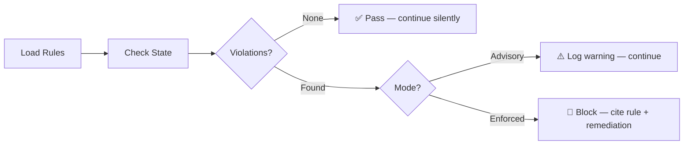

# Constitution Guide

Lens enforces governance through the **constitution skill** — inline checks that run automatically at every workflow boundary. You never invoke governance manually. The constitution skill validates rules silently and surfaces results only when something needs attention.

## How Governance Works

The constitution skill activates at two trigger points:

- **`workflow_start`** — Before any workflow begins, the skill validates that prerequisites are met
- **`phase_transition`** — Before advancing to the next phase, the skill validates all gate conditions

The execution model has four steps:



1. **Load rules** — The skill reads governance rules applicable to the current phase
2. **Check state** — Rules are evaluated against current state, artifacts, and branch topology
3. **Report** — Results are logged to `event-log.jsonl`
4. **Act** — In advisory mode, violations produce warnings. In enforced mode, critical violations block progress.

## Governance Rules

The constitution validates six areas. Each area has specific rules, and violations include a rule citation and remediation guidance.

### 1. Initiative Structure

Validates that the initiative config is well-formed.

| Rule | What it checks | Example violation |
|------|---------------|-------------------|
| Required fields | `id`, `type`, `name` all present and non-empty | `"Initiative missing required field: name"` |
| Valid type | Type is `domain`, `service`, or `feature` | `"Invalid initiative type: 'epic'"` |
| Hierarchy consistency | Feature has parent service, service has parent domain | `"Feature initiative missing service_prefix"` |
| `featureBranchRoot` set | Feature initiatives have a computed root | `"feature_branch_root is empty for feature initiative"` |

### 2. Phase Progression

Validates that phases advance in the correct order.

| Rule | What it checks | Example violation |
|------|---------------|-------------------|
| Sequential order | Phases advance P1→P2→P3→P4→P5→P6 | `"Cannot start P3 (tech-plan): P2 (plan) gate not passed"` |
| Gate passed | Previous phase gate is `passed` before next begins | `"Gate pre-plan=not-started. Run /pre-plan first."` |
| No skipping | Cannot jump from P1 to P3 | `"Phase skip detected: current=P1, requested=P3"` |

### 3. Gate Requirements

Validates that gate conditions are satisfied before marking a phase as passed.

| Rule | What it checks | Example violation |
|------|---------------|-------------------|
| Required artifacts exist | Phase-specific required files present | `"Missing required artifact: product-brief.md (P1)"` |
| Checklist complete | All required checklist items are `done` | `"Checklist incomplete: 2/3 required items done"` |
| Artifacts non-stale | Required artifacts were modified in current phase | `"Artifact prd.md not modified in current phase"` |

### 4. Branch Topology

Validates that git branches match the expected topology.

| Rule | What it checks | Example violation |
|------|---------------|-------------------|
| Naming pattern | Branches follow `{featureBranchRoot}-{audience}-p{N}` | `"Branch 'feature/auth' uses slash separator"` |
| Audience branches exist | All configured audiences have branches on remote | `"Missing audience branch: platform-user-mgmt-auth-flow-medium"` |
| Phase parent correct | Phase branch was created from the correct audience branch | `"Phase branch parent mismatch: expected small, got large"` |

### 5. State Consistency

Validates that `state.yaml` and the initiative config are in sync.

| Rule | What it checks | Example violation |
|------|---------------|-------------------|
| Active initiative exists | `state.yaml` references a valid initiative config | `"Active initiative 'auth-flow' has no config file"` |
| Dual-write sync | `gate_status` matches between state and initiative config | `"State/config drift: state says plan=passed, config says plan=not-started"` |
| Phase alignment | `current_phase` matches between state and initiative config | `"State says P2, config says P1"` |

### 6. Audience Configuration

Validates audience settings are coherent.

| Rule | What it checks | Example violation |
|------|---------------|-------------------|
| Minimum one audience | Audiences list is not empty | `"No audiences configured for feature initiative"` |
| Valid map | `review_audience_map` references defined audiences | `"review_audience_map.p2 references 'medium' but audiences=[small,large]"` |
| Map completeness | All six phases have a mapping | `"review_audience_map missing entry for p4"` |

## Governance Modes

### Advisory Mode (Default)

In advisory mode, constitution checks run and log warnings but never block progress. This is appropriate for solo developers and small teams who want visibility without friction.

When a violation is found:

```text
⚠️ Constitution warning (advisory):
├── Rule: Phase Progression — gate check
├── Detail: Gate pre-plan=not-started, proceeding anyway
└── Logged to event-log.jsonl
```

The warning appears in the workflow output. The operation continues.

### Enforced Mode

In enforced mode, critical violations block progress. You must resolve the violation before the workflow can continue. This is appropriate for teams with strict governance requirements.

When a critical violation is found:

```text
🚫 Constitution violation (enforced):
├── Rule: Phase Progression — sequential order
├── Detail: Cannot start P3 (tech-plan): P2 (plan) gate not passed
├── Remediation: Run /plan to complete Phase 2 first
└── Status: BLOCKED — resolve violation to continue
```

Non-critical violations in enforced mode still produce warnings (like advisory mode) and do not block.

### Switching Modes

Set the mode per-initiative in the initiative config:

```yaml
# _bmad-output/lens/initiatives/auth-flow.yaml
constitution_mode: enforced    # advisory | enforced
```

You can change modes at any time by editing the file directly. The change takes effect on the next Lens command.

## Viewing Constitution Results

Three ways to see governance results:

| Method | What you see |
|--------|-------------|
| `/status` | Critical violations only (compact view) |
| `/lens` | All violations and warnings with full detail |
| Event log | Complete history of every check — pass, warning, and block |

The event log records every constitution check as an event:

```json
{"ts": "2026-02-17T10:35:00Z", "event": "constitution_check", "initiative": "auth-flow", "user": "jane@example.com", "details": {"phase": "p2", "mode": "advisory", "result": "pass", "rules_checked": 12, "violations": 0}}
```

## Related Documentation

- [Architecture](architecture.md) — How the constitution skill fits into the background workflow system
- [Configuration](configuration.md) — Setting `constitution_mode` per-initiative
- [API Reference](api-reference.md) — Event types and state schema
- [Troubleshooting](troubleshooting.md) — Resolving constitution violations that block progress
