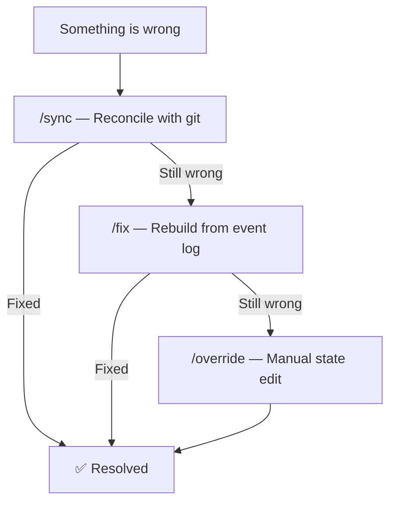

# Troubleshooting

This guide covers common issues, the recovery command ladder, diagnostic techniques, and edge cases you may encounter while using Lens.

## Recovery Ladder

Lens has a three-tier recovery system. Start with the lightest fix and escalate only if needed:



| Tier | Command | What it does | When to use |
|------|---------|-------------|-------------|
| 1 | `/sync` | Compares `state.yaml` against actual git branches. Fixes drift, missing branches, and stale references. | State seems slightly off. Branch was deleted externally. |
| 2 | `/fix` | Reads `event-log.jsonl` and replays events chronologically to rebuild `state.yaml` from scratch. | `state.yaml` is corrupted or has inconsistent data. `/sync` did not resolve it. |
| 3 | `/override` | Lets you manually set any state field. | Event log is also damaged, or you need to force a specific state. |

All three commands are idempotent — running them multiple times produces the same result.

## Common Issues

### No Active Initiative

**Symptom:** Commands fail with `"No active initiative. Run /new first."`

**Cause:** No initiative has been created, or the previously active initiative was archived.

**Fix:**

- Create a new initiative: `@lens /new`
- Or switch to an existing one: `@lens /switch`

**Prevention:** After archiving an initiative, immediately switch to another or create a new one.

---

### State File Missing

**Symptom:** `state.yaml not found` error on any command.

**Cause:** The file was deleted, moved, or never initialized.

**Fix:**

1. Run `@lens /onboard` to reinitialize the environment
2. If initiatives already exist, run `@lens /sync` to restore state from git branches
3. If the event log still exists, run `@lens /fix` to rebuild state from history

**Prevention:** Do not manually delete files in `_bmad-output/lens/`.

---

### State Corruption

**Symptom:** `/status` shows incorrect phase, wrong initiative, or stale gate data. Phase commands refuse to run despite prior phases being complete.

**Cause:** Manual file edit, interrupted workflow, or dual-write sync failure between `state.yaml` and the initiative config.

**Fix:**

1. **Try `/sync`** — Reconciles state with actual git branches
2. **Try `/fix`** — Rebuilds from event log. This replays all events starting from an empty state template and recomputes every field.
3. **Try `/override`** — Manually set the specific field that is wrong:
   ```text
   @lens /override
   # Select: gate_status
   # Set: plan = passed
   ```

**Prevention:** Do not edit `state.yaml` or initiative config files manually. Use Lens commands for all state changes.

---

### Branch Does Not Exist

**Symptom:** Git checkout fails. Lens reports a missing branch.

**Cause:** Terminal was deleted externally (by another user, a cleanup script, or manual `git branch -d`).

**Fix:**

1. Run `@lens /sync` — Detects missing branches and reports them
2. If the branch should exist, check if it was pushed: `git branch -r | grep {branch-name}`
3. If the remote has it: `git checkout -b {branch-name} origin/{branch-name}`
4. If the branch is truly gone and was a phase branch, you may need to recreate it by re-running the phase command

**Prevention:** Do not delete branches manually while Lens is managing them.

---

### Constitution Violations Blocking Progress

**Symptom:** A phase command refuses to advance. Output shows `🚫 Constitution violation (enforced)`.

**Cause:** The initiative uses `constitution_mode: enforced` and a critical governance rule failed.

**Fix:**

1. Read the violation message — it cites the specific rule and includes remediation steps
2. Address the root cause (produce missing artifacts, fix state drift, correct branch topology)
3. Run the phase command again
4. If the check is a false positive, switch to advisory mode temporarily:
   ```yaml
   # Edit _bmad-output/lens/initiatives/{id}.yaml
   constitution_mode: advisory
   ```

**Prevention:** Use advisory mode during exploratory phases. Switch to enforced mode for later phases where governance is critical.

---

### Background Errors in Status

**Symptom:** `/status` shows items in the `background_errors` array.

**Cause:** A background workflow (state-sync, branch-validate, event-log, constitution-check, or checklist-update) encountered an error during automatic execution.

**Fix:**

1. Run `@lens /lens` to see full error details
2. Check `state.yaml` — the `background_errors` array contains error objects with timestamps and messages
3. Address the root cause:
   - Branch validation error → check that expected branches exist on remote
   - State-sync error → run `/sync`
   - Event-log error → verify `event-log.jsonl` is writable
   - Constitution error → see "Constitution Violations" above
4. Run `@lens /sync` to clear resolved errors from the array

**Prevention:** Background errors are informational. In most cases, the next successful command clears them.

---

### Interrupted Workflow

**Symptom:** Lens shows `workflow_status: running` but no workflow is actually in progress. Or you intentionally paused mid-workflow with `pause`.

**Cause:** A workflow was interrupted (IDE crash, network disconnect, user closed chat) or you used the `pause` keyword.

**Fix:**

```text
@lens /resume
```

Lens finds the last `workflow_start` event without a matching `workflow_end` in the event log and resumes from that point.

If `/resume` cannot determine where you left off, use `/override` to set `workflow_status: idle` and restart the phase command.

**Prevention:** Use `pause` to save progress before stepping away. Lens records a checkpoint that enables clean resumption.

---

### Wrong Active Initiative

**Symptom:** Commands operate on the wrong initiative. Status shows an initiative you are not working on.

**Cause:** You forgot to switch after creating or working on a different initiative.

**Fix:**

```text
@lens /switch
```

Lens lists all initiatives and lets you select the correct one.

**Prevention:** Run `/status` at the start of each session to confirm the active initiative.

---

### Audience Map Mismatch

**Symptom:** A phase targets an unexpected audience branch. For example, P2 goes to `large` instead of `medium`.

**Cause:** The `review_audience_map` in the initiative config is misconfigured, or a custom audience list does not have enough entries.

**Fix:**

1. Check the initiative config: `_bmad-output/lens/initiatives/{id}.yaml`
2. Verify the `review_audience_map` has correct entries for all six phases
3. Verify the `audiences` list includes all audience names referenced in the map
4. Edit the config file directly if corrections are needed (this is one case where direct file editing is acceptable)

**Prevention:** During `/new`, review the audience configuration carefully before confirming.

---

### Stale Branch After Phase Completion

**Symptom:** Old phase branches still exist on the remote after the phase PR was merged.

**Cause:** The branch deletion step failed (network issue, permission error) or was skipped.

**Fix:**

Delete the stale branches manually:

```bash
git push origin --delete {featureBranchRoot}-{audience}-p{N}
git branch -d {featureBranchRoot}-{audience}-p{N}
```

Then run `@lens /sync` to update state.

**Prevention:** Verify remote connectivity before finishing a phase.

---

### Post-Migration Issues (from lens-work)

**Symptom:** State references old paths (`_bmad/lens-work/`, `_bmad-output/lens-work/`), old agent names, or slash-based branches.

**Cause:** Migration from lens-work was incomplete.

**Fix:** See [Migration from lens-work](migration-from-lens-work.md) for the complete migration procedure.

## Diagnostic Commands

| Command | What it shows | Use when |
|---------|---------------|----------|
| `/status` | Compact view: initiative, phase, branch, checklist summary, errors | Quick health check |
| `/lens` | Full expanded view: all gates, full checklist, branch topology, recent events, config | Deep investigation |
| `/sync` | State comparison report: expected vs. actual branches, drift detection | Something seems off |

For deeper investigation, you can also inspect the raw files:

| File | Location | Contains |
|------|----------|----------|
| State | `_bmad-output/lens/state.yaml` | Current active initiative state |
| Event log | `_bmad-output/lens/event-log.jsonl` | Complete history of all operations |
| Initiative config | `_bmad-output/lens/initiatives/{id}.yaml` | Per-initiative settings and gate status |

## Related Documentation

- [Architecture](architecture.md) — How the two-file state system and background workflows operate
- [Configuration](configuration.md) — Governance mode, audiences, and other settings
- [Constitution Guide](constitution-guide.md) — Understanding governance rules and violations
- [API Reference](api-reference.md) — State schema and event types
