# Visual-Documentation Skill

**Version:** 1.0.0  
**Last Updated:** 2026-03-01  
**Contract:** All lens-work document generation MUST include visual Mermaid diagrams

---

## Purpose

This skill provides comprehensive guidance for creating visually-enhanced documentation in lens-work. Every document written by lens-work MUST include at least one Mermaid diagram to show information visually, as mandated by the `visual_first_documentation` convention in bmadconfig.yaml.

---

## Part 1: Core Principles

### Visual-First Mindset

**Before writing ANY document:**

1. **Identify what to visualize** - relationships, flows, hierarchies, timelines
2. **Choose diagram type** - flowchart, sequence, class, ER, state, gantt, etc.
3. **Create diagram BEFORE text** - let the visual guide your narrative
4. **Place diagram early** - within first 20% of document after overview
5. **Explain diagram** - add brief text context before and after

### Mandatory Diagram Rule

```yaml
enforcement: HARD
rule: |
  EVERY document generated by lens-work MUST contain at least one
  Mermaid diagram. Documents without visual content are INCOMPLETE
  and must be regenerated with diagrams.
```

---

## Part 2: Diagram Type Selection Matrix

Use this decision table to select the appropriate Mermaid diagram type:

| Content Type | Diagram Type | Use When |
|-------------|-------------|----------|
| Process flow, decision logic | `flowchart TD` | Showing steps, branches, outcomes |
| Time-based interactions | `sequenceDiagram` | API calls, auth flows, message passing |
| Code/system structure | `classDiagram` | Classes, components, modules, relationships |
| Database/entities | `erDiagram` | Data models, entity relationships, schemas |
| State transitions | `stateDiagram-v2` | Lifecycle, workflow states, status changes |
| Timeline/schedule | `gantt` | Project phases, sprints, milestones |
| Branch strategy | `gitGraph` | Git workflows, release processes |
| Concept hierarchy | `mindmap` | Feature trees, idea maps, categories |

---

## Part 3: Document-Specific Diagram Requirements

### Product-Brief.md

**Minimum Required:**
- Problem-solution flow diagram (flowchart)
- Stakeholder map (flowchart)

**Example:**
````markdown
## Problem Statement

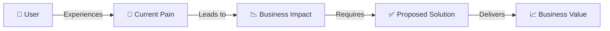
````

### PRD.md (Product Requirements Document)

**Minimum Required:**
- User journey flow (flowchart)
- Feature relationship diagram (flowchart or mindmap)

**Example:**
````markdown
## User Journey

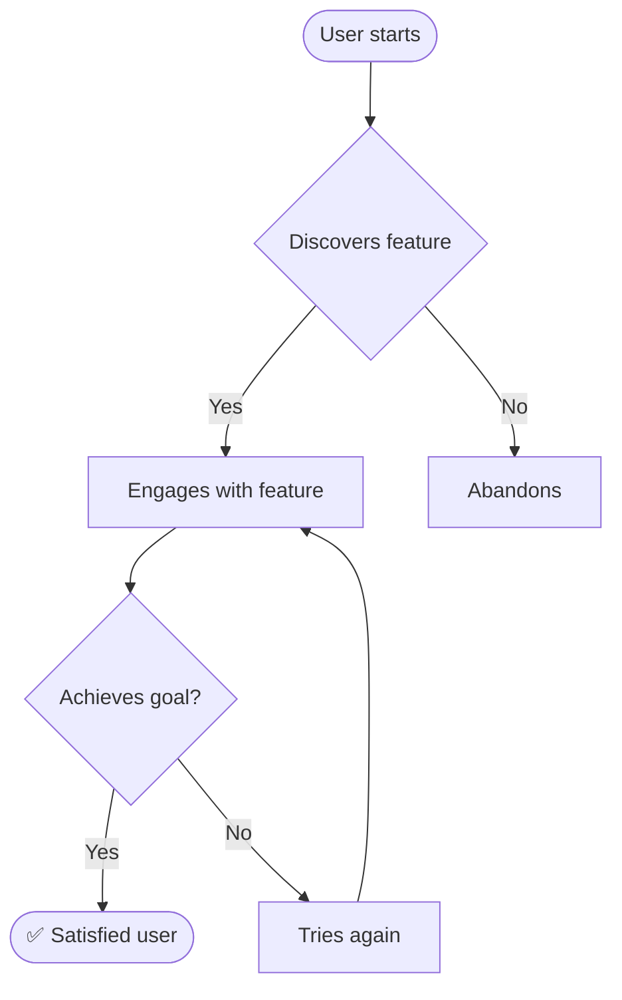
````

### Architecture.md

**Minimum Required:**
- System architecture diagram (flowchart or C4)
- Component interaction diagram (sequenceDiagram)
- Deployment diagram (flowchart)

**Example:**
````markdown
## System Architecture

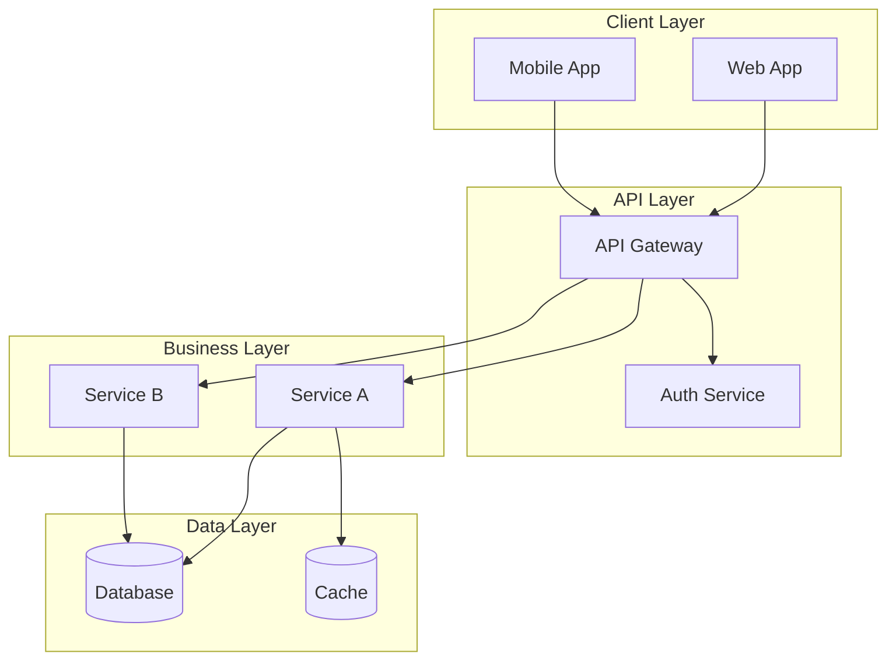
````

### Epics.md

**Minimum Required:**
- Epic dependency graph (flowchart)
- Feature timeline (gantt)

**Example:**
````markdown
## Epic Dependencies

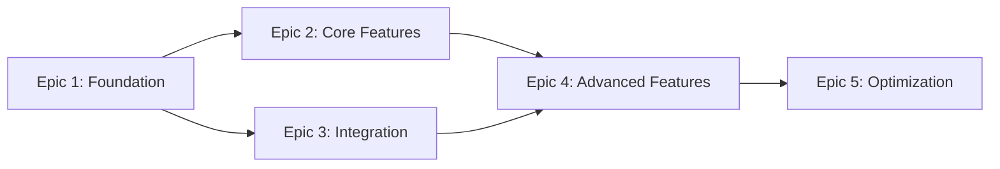
````

### Stories.md

**Minimum Required:**
- Story dependency graph (flowchart)
- Acceptance criteria workflow (flowchart)

**Example:**
````markdown
## Story Dependencies

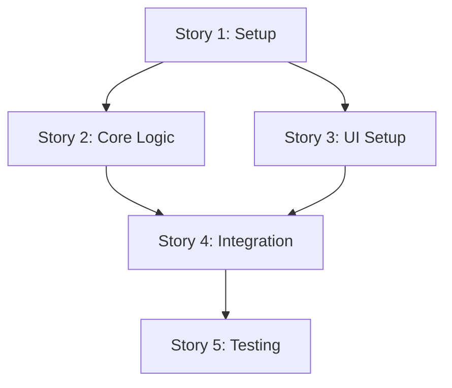
````

### TechPlan.md

**Minimum Required:**
- Technical architecture diagram (flowchart or C4)
- Deployment flow (flowchart)
- Data flow diagram (sequenceDiagram)

**Example:**
````markdown
## Technical Architecture

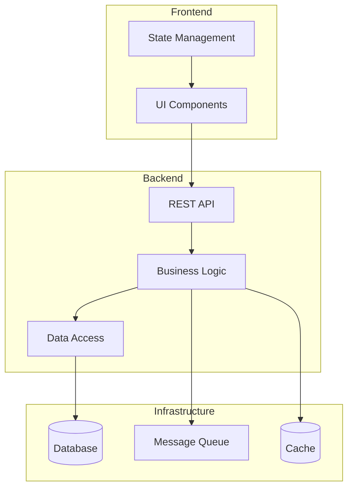

## Deployment Flow

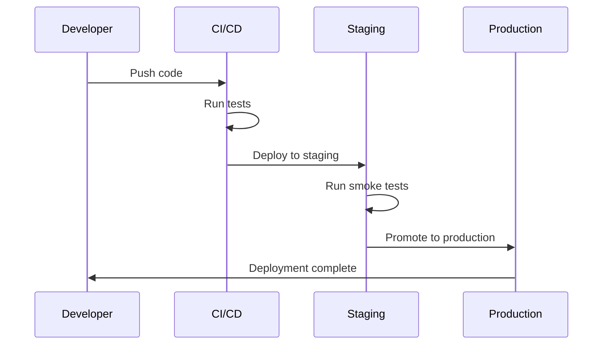
````

### Constitution.md

**Minimum Required:**
- Constitution hierarchy diagram (flowchart)
- Compliance evaluation flow (flowchart)

**Example:**
````markdown
## Constitution Hierarchy

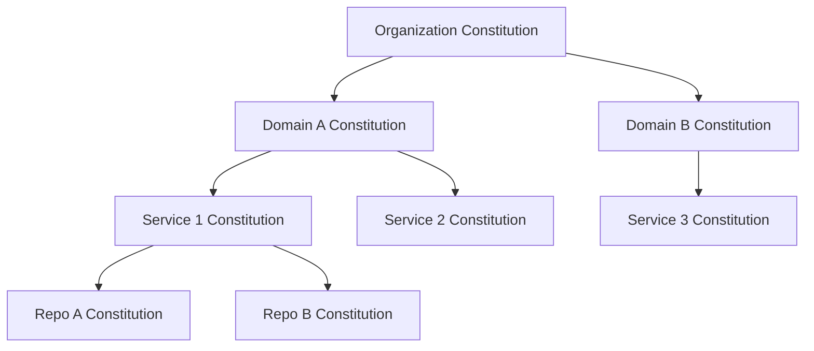
````

### Discovery/Analysis Documents

**Minimum Required:**
- Code structure diagram (classDiagram)
- API flow diagram (sequenceDiagram)
- Data model diagram (erDiagram)

**Example:**
````markdown
## Data Model

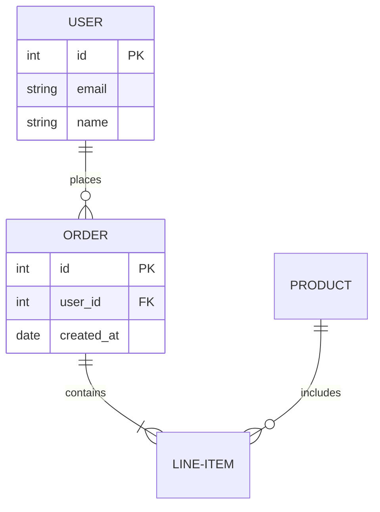
````

---

## Part 4: Diagram Quality Standards

### Syntax Requirements

1. **Always specify diagram type on first line**
   ```mermaid
   flowchart TD
   ```

2. **Use valid Mermaid v10+ syntax**
   - Test mentally before outputting
   - Reference: https://mermaid.js.org/

3. **Node naming conventions**
   - Clear, concise labels (3-7 words ideal)
   - Use descriptive IDs: `UserAuth`, `DBQuery`, `APICall`
   - Avoid generic IDs: `A1`, `Node1`, `Thing`

4. **Optimal node count**
   - Ideal: 5-10 nodes
   - Maximum: 15 nodes
   - If more needed: split into multiple diagrams or use subgraphs

### Visual Clarity

1. **Use subgraphs for logical grouping**
   ````markdown
   ```mermaid
   flowchart TB
       subgraph "Frontend"
           UI[User Interface]
       end
       subgraph "Backend"
           API[API Server]
       end
   ```
   ````

2. **Add icons/emojis for visual anchors**
   ```mermaid
   flowchart LR
       User[👤 User] --> Auth[🔐 Authentication]
       Auth --> Data[💾 Database]
   ```

3. **Use directional arrows meaningfully**
   - `-->` for flow/process
   - `-.->` for optional/async
   - `==>` for emphasis
   - `--x` for blocked/failed

4. **Color and styling (when supported)**
   ```mermaid
   flowchart LR
       A[Start]:::green --> B[Process]
       B --> C[Error]:::red
       classDef green fill:#9f6,stroke:#333
       classDef red fill:#f66,stroke:#333
   ```

---

## Part 5: Diagram Placement Strategy

### Primary Diagram Placement

```yaml
rule: Place primary diagram within first 20% of document after overview
timing: AFTER problem statement, BEFORE detailed sections
rationale: Gives reader immediate visual context
```

**Example Structure:**
```markdown
# Document Title

## Overview
[2-3 paragraphs of context]

## System Architecture
[1 paragraph introducing the diagram]

```mermaid
[PRIMARY DIAGRAM HERE]
```

[1-2 paragraphs explaining key points from diagram]

## Detailed Sections
...
```

### Secondary Diagram Placement

```yaml
rule: Add diagrams throughout to break text blocks > 100 lines
frequency: At least one diagram per major section
placement: Before or after complex explanations
```

### Diagram-Text Relationship

**Before diagram:**
- Introduce what the diagram shows (1-2 sentences)
- Set context for what reader should notice

**After diagram:**
- Explain key flows or relationships (2-4 sentences)
- Highlight important details not obvious from visual
- Cross-reference related sections

**Example:**
```markdown
The authentication flow involves three key components working together.
The following diagram shows how user credentials are validated:

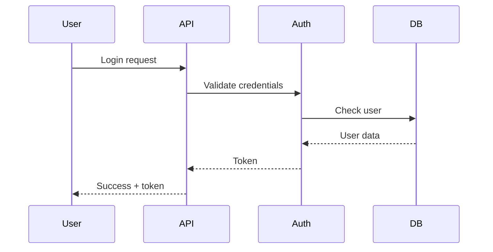

Notice how the authentication service acts as the central validator,
querying the database only after initial credential validation. This
reduces database load and improves response time. See "Security
Considerations" for token handling details.
```

---

## Part 6: Common Diagram Patterns

### Pattern 1: Decision Flow

**Use for:** Conditional logic, approval processes, branching scenarios

````markdown
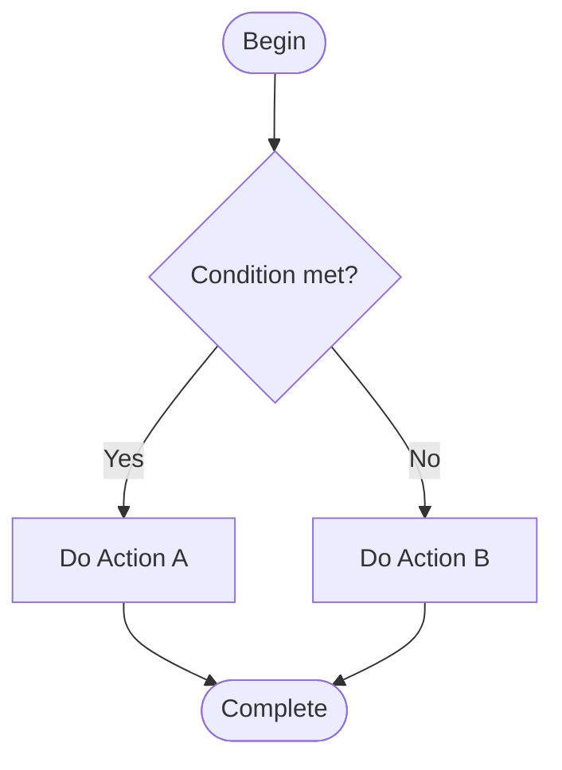
````

### Pattern 2: Request/Response Flow

**Use for:** API interactions, service communication, data exchange

````markdown
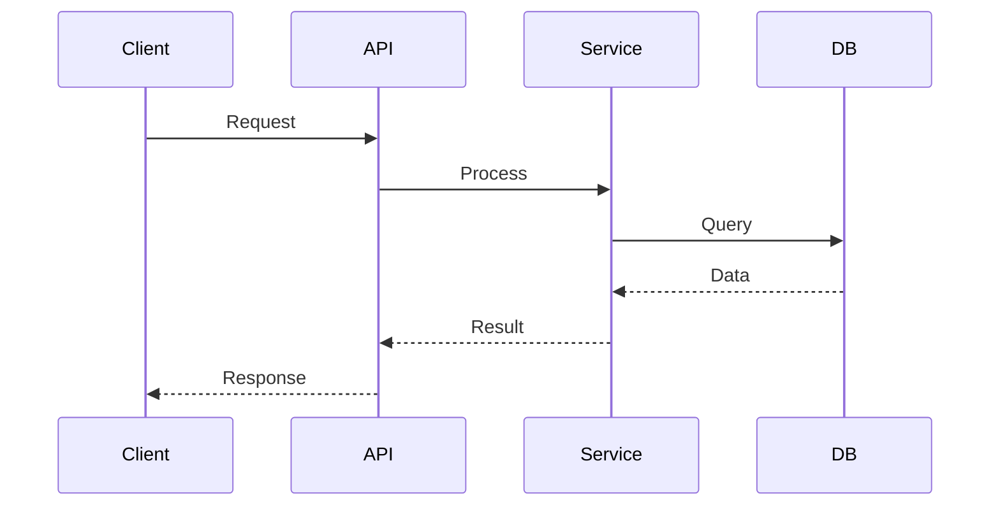
````

### Pattern 3: State Machine

**Use for:** Status transitions, workflow stages, lifecycle

````markdown
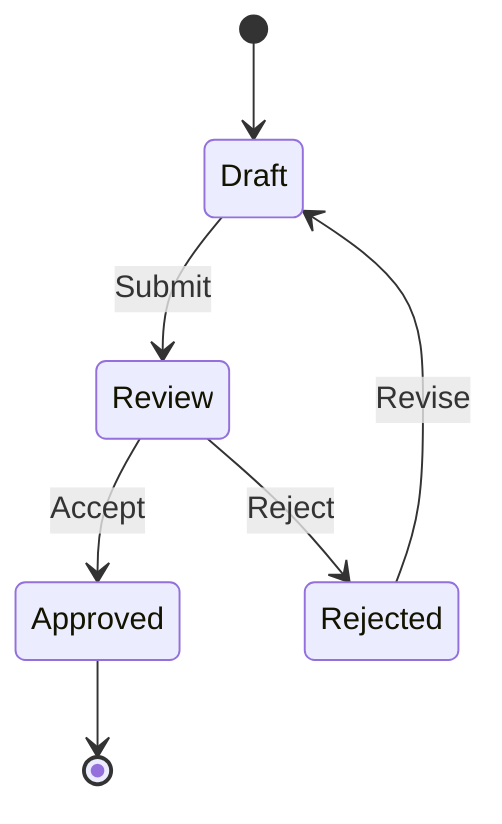
````

### Pattern 4: Component Hierarchy

**Use for:** System composition, feature breakdown, organizational structure

````markdown
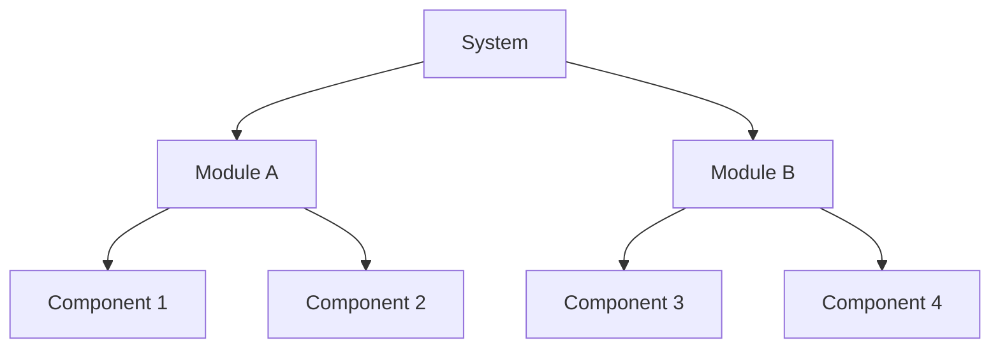
````

### Pattern 5: Timeline/Phases

**Use for:** Project schedules, sprint planning, milestone tracking

````markdown
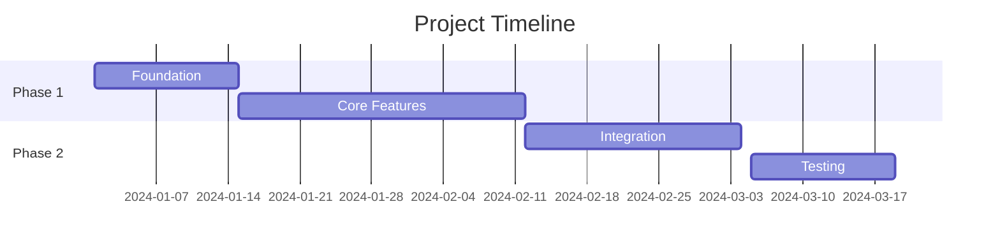
````

### Pattern 6: Data Model

**Use for:** Database schemas, entity relationships, data structures

````markdown
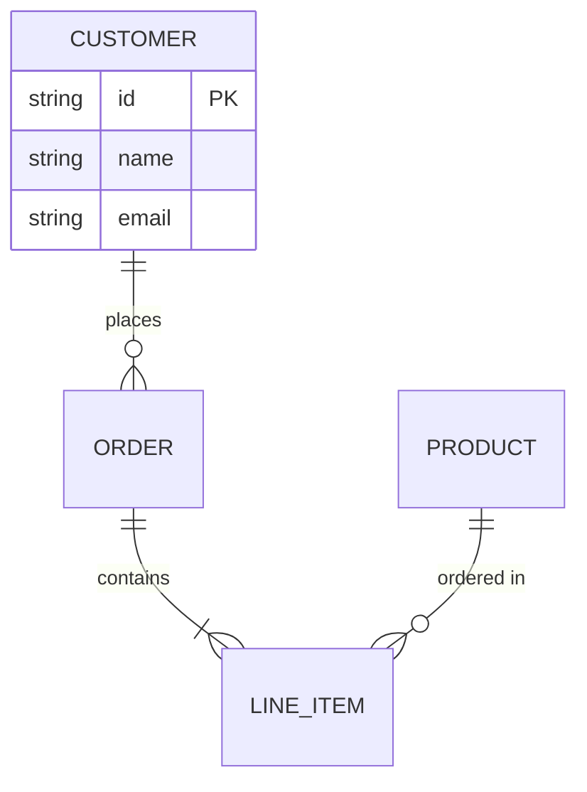
````

---

## Part 7: Workflow Integration

### Document Generation Checklist

**Before writing ANY document:**

- [ ] Load bmadconfig.yaml visual_first_documentation convention
- [ ] Identify document type (PRD, architecture, epics, etc.)
- [ ] Review mandatory diagram requirements for document type
- [ ] Gather data/relationships to visualize
- [ ] Choose appropriate diagram type(s)
- [ ] Create primary diagram
- [ ] Validate diagram syntax
- [ ] Place diagram in document structure (first 20%)
- [ ] Write introductory text before diagram
- [ ] Write explanatory text after diagram
- [ ] Add secondary diagrams as needed (every 100+ lines)
- [ ] Verify minimum diagram count met
- [ ] Final validation: document not complete without diagrams

### Workflow Step Pattern

**For any workflow step that generates a document:**

```yaml
step_N_generate_document:
  - Load visual-documentation skill (this file)
  - Identify document type and required diagrams
  - Gather visualization data
  - Create diagrams using Mermaid syntax
  - Validate diagram syntax
  - Build document with diagrams integrated
  - Verify: document has minimum required diagrams
  - Save document
  - HALT if diagrams missing: regenerate with visuals
```

### Document Template Pattern

**Every document template should include:**

```markdown
# {Document Title}

## Overview
{Context paragraph}

## {Primary Visual Section}
{Diagram introduction}

```mermaid
{PRIMARY_DIAGRAM_TYPE}
{diagram content}
```

{Diagram explanation}

## {Detailed Sections}
...

{Secondary diagrams as needed}
```

---

## Part 8: Error Prevention

### Common Mistakes to Avoid

1. **Missing diagram entirely**
   - ❌ Writing complete document without any diagram
   - ✅ Always create at least one diagram per document

2. **Diagram syntax errors**
   - ❌ Invalid Mermaid syntax that won't render
   - ✅ Validate syntax before including in document

3. **Diagram placement too late**
   - ❌ Diagram at end of document after all text
   - ✅ Primary diagram in first 20% of document

4. **Diagram too complex**
   - ❌ 30 nodes in one diagram, impossible to read
   - ✅ Split into multiple focused diagrams or use subgraphs

5. **Missing diagram context**
   - ❌ Diagram with no introduction or explanation
   - ✅ Text before and after diagram explaining content

6. **Wrong diagram type**
   - ❌ Using flowchart for API interactions
   - ✅ Use sequenceDiagram for temporal/request flows

7. **Placeholder diagrams**
   - ❌ `{Insert diagram here}` or TODO comments
   - ✅ Complete, valid Mermaid diagram with actual content

### Validation Rules

**Before finalizing any document:**

```yaml
validation_checklist:
  - confirm: At least one Mermaid diagram present
  - confirm: Diagram syntax is valid Mermaid v10+
  - confirm: Primary diagram in first 20% of document
  - confirm: Diagram has 5-15 nodes (not too complex)
  - confirm: Text before diagram introduces content
  - confirm: Text after diagram explains key points
  - confirm: Required diagram types present (per document type)
  - confirm: Diagrams break up long text blocks
  - fail_action: Regenerate document with proper diagrams
```

---

## Part 9: Examples by Document Type

### Example: Product-Brief.md with Diagrams

````markdown
# Product Brief: Customer Portal Enhancement

## Overview
Our B2B customers currently lack a unified dashboard for managing their accounts...

## Problem & Solution Flow

The following diagram illustrates the current pain point and our proposed solution:

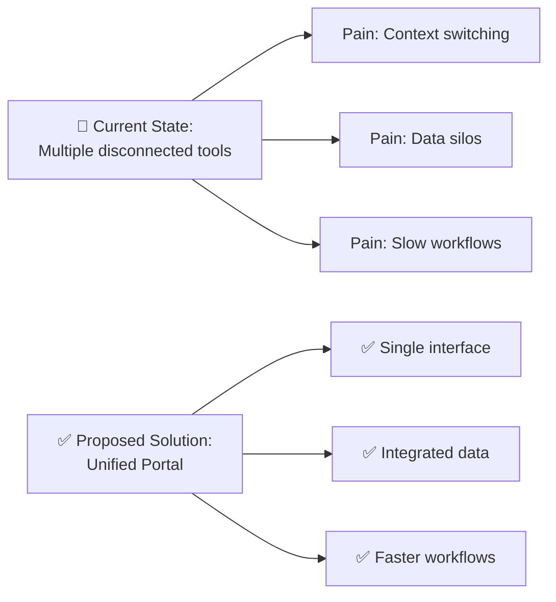

As shown above, the unified portal addresses three critical pain points
by consolidating tools, integrating data sources, and streamlining workflows.

## Stakeholder Map

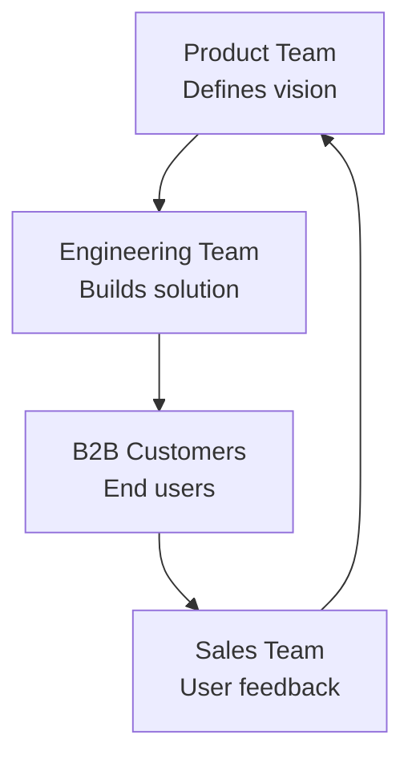

...
````

### Example: Architecture.md with Diagrams

````markdown
# Technical Architecture: Customer Portal

## System Overview

The customer portal follows a modern microservices architecture with clear
separation between frontend, API gateway, and backend services:

```mermaid
flowchart TB
    subgraph "Client Layer"
        Web[React Web App]
        Mobile[React Native Mobile]
    end
    
    subgraph "API Layer"
        Gateway[API Gateway<br/>Kong]
        Auth[Auth Service<br/>OAuth2]
    end
    
    subgraph "Business Services"
        Account[Account Service]
        Billing[Billing Service]
        Analytics[Analytics Service]
    end
    
    subgraph "Data Layer"
        PrimaryDB[(PostgreSQL<br/>Primary DB)]
        AnalyticsDB[(ClickHouse<br/>Analytics)]
        Cache[(Redis Cache)]
    end
    
    Web --> Gateway
    Mobile --> Gateway
    Gateway --> Auth
    Gateway --> Account
    Gateway --> Billing
    Gateway --> Analytics
    
    Account --> PrimaryDB
    Billing --> PrimaryDB
    Analytics --> AnalyticsDB
    Account --> Cache
    Billing --> Cache
```

The architecture separates concerns across four layers: client (web/mobile),
API (gateway + auth), business services (account/billing/analytics), and
data (PostgreSQL/ClickHouse/Redis).

## Authentication Flow

```mermaid
sequenceDiagram
    participant User
    participant WebApp
    participant Gateway
    participant Auth
    participant Service
    
    User->>WebApp: Login
    WebApp->>Gateway: POST /auth/login
    Gateway->>Auth: Validate credentials
    Auth->>Auth: Generate JWT
    Auth-->>Gateway: JWT token
    Gateway-->>WebApp: Token + refresh token
    WebApp->>WebApp: Store tokens
    WebApp->>Gateway: API request + JWT
    Gateway->>Auth: Validate JWT
    Auth-->>Gateway: Valid
    Gateway->>Service: Forward request
    Service-->>Gateway: Response
    Gateway-->>WebApp: Response
    WebApp-->>User: Display data
```

...
````

---

## Part 10: Quick Reference

### Diagram Type Cheat Sheet

| Diagram | Syntax Start | Best For |
|---------|-------------|----------|
| Flowchart | `flowchart TD` | Processes, decisions, architecture |
| Sequence | `sequenceDiagram` | APIs, auth flows, interactions |
| Class | `classDiagram` | Code structure, components |
| ER | `erDiagram` | Data models, database schemas |
| State | `stateDiagram-v2` | Lifecycles, state machines |
| Gantt | `gantt` | Timelines, schedules |
| Git | `gitGraph` | Branch strategies |
| Mind | `mindmap` | Hierarchies, idea maps |

### Document Type Requirements

| Document Type | Minimum Diagrams | Required Types |
|--------------|------------------|----------------|
| product-brief.md | 2 | flowchart (problem-solution, stakeholders) |
| prd.md | 2 | flowchart (user journey, features) |
| architecture.md | 3 | flowchart (system), sequenceDiagram (interaction), flowchart (deployment) |
| epics.md | 2 | flowchart (dependencies), gantt (timeline) |
| stories.md | 2 | flowchart (dependencies, acceptance) |
| techplan.md | 3 | flowchart (architecture), sequenceDiagram (data flow), flowchart (deployment) |
| constitution.md | 2 | flowchart (hierarchy, compliance) |
| discovery docs | 3 | classDiagram (code), sequenceDiagram (API), erDiagram (data) |

### Integration Points

All workflows and agents must reference this skill when generating documents:

- `_bmad/lens-work/workflows/router/plan/workflow.md`
- `_bmad/lens-work/workflows/router/tech-plan/workflow.md`
- `_bmad/lens-work/workflows/router/devproposal/workflow.md`
- `_bmad/lens-work/workflows/router/sprintplan/workflow.md`
- `_bmad/lens-work/workflows/discovery/generate-docs/workflow.md`
- `_bmad/lens-work/workflows/governance/constitution/workflow.md`
- `_bmad/bmm/agents/pm/pm.md` (Product Manager agent)
- `_bmad/bmm/agents/architect/architect.md` (Architect agent)
- `_bmad/bmm/agents/tech-writer/tech-writer.md` (Tech Writer agent)

---

## Part 11: Enforcement

### Hard Rules (Non-Negotiable)

1. **Every document MUST have at least one Mermaid diagram**
   - No exceptions
   - Documents without diagrams are INCOMPLETE

2. **Primary diagram MUST appear in first 20% of document**
   - After overview, before detailed sections
   - Provides immediate visual context

3. **Diagram syntax MUST be valid Mermaid v10+**
   - Validates before inclusion
   - Must render correctly

4. **Required diagram types MUST be present per document type**
   - architecture.md needs system + interaction + deployment diagrams
   - PRD needs user journey + feature relationship diagrams
   - etc. per Part 3

### Validation Gates

Any workflow that generates a document MUST:

1. Load this skill (visual-documentation.md)
2. Load bmadconfig.yaml visual_first_documentation convention
3. Identify required diagrams for document type
4. Create diagrams before writing text
5. Validate diagram syntax
6. Verify diagram placement (first 20%)
7. Confirm minimum diagram count
8. **HALT and regenerate if diagrams missing or invalid**

### Defect Classification

**Critical Defects (immediate fix required):**
- Document has zero diagrams
- Primary diagram syntax invalid (won't render)
- Required diagram types missing (per document type)

**Major Defects (should fix):**
- Primary diagram placed too late (after 20%)
- Diagram too complex (>15 nodes, unclear)
- No text context around diagram

**Minor Issues (optional improvement):**
- Could use more secondary diagrams
- Diagram styling could be enhanced
- Additional diagram types would help

---

## Skill Update Protocol

This skill is versioned and maintained. Updates should:

1. Increment version number
2. Update "Last Updated" date
3. Document changes in commit message
4. Validate against bmadconfig.yaml visual_first_documentation convention
5. Update affected workflows to reference new version

**Current Version:** 1.0.0  
**Effective Date:** 2026-03-01

---

*This skill is part of the lens-work module and implements the visual_first_documentation convention from bmadconfig.yaml.*
