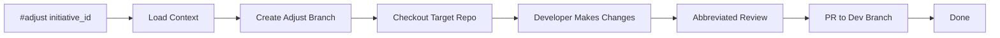

# Adjust Workflow — Lightweight Post-Dev Tweaks

Quick-entry utility for making minor adjustments to a completed dev story without
the full `/dev` ceremony. Use when the code review is done, the PR is merged, but
small tweaks or polish are needed.

## Overview



**Ceremony level:** ~10 minutes (vs ~45 min for #fix-story, vs ~2 hrs for /dev)

## When to Use

- Post-dev polish: typos, formatting, small refactors
- Config adjustments: environment variables, feature flags, thresholds
- Test additions: adding missing edge-case tests
- Documentation: inline comments, docstrings, README updates
- Dependency bumps: minor version updates with no behavior change

## When NOT to Use (Use /dev Instead)

- New features or significant behavior changes
- Architecture changes or new components
- Changes that touch >5 files or >100 lines
- Changes requiring new planning artifacts
- Changes that would fail pre-implementation constitution gates

---

## Pre-Conditions

- [ ] Active initiative exists (initiative_id is valid)
- [ ] Initiative has completed at least one /dev cycle (phase == dev, stories completed)
- [ ] Working directory is the BMAD control repo root
- [ ] Target repo is accessible

---

## Workflow Steps

### 1. Parse and Validate

```yaml
# Parse initiative ID from command
initiative_id = parse_argument(command, position=1)

if !initiative_id:
  error: |
    Usage: #adjust <initiative_id>
    Example: #adjust BMAD-42

# Load initiative state
initiative = load("_bmad-output/lens-work/initiatives/${initiative_id}.yaml")

if !initiative:
  error: "Initiative ${initiative_id} not found."

# Validate phase — must have reached dev at some point
if initiative.phase not in ["dev", "promote", "complete"]:
  error: |
    Initiative ${initiative_id} is in phase "${initiative.phase}".
    #adjust is only available after at least one /dev cycle.
    Use /dev to start implementation first.

# Load target repo info
target_repo = initiative.target_repo
target_path = resolve_target_path(target_repo)

output: |
  ═══ Adjust Mode ═══

  Initiative: ${initiative_id} — ${initiative.name}
  Target: ${target_repo}
  Phase: ${initiative.phase}
  Last Dev Story: ${initiative.last_completed_story || "unknown"}

  ℹ️  Lightweight adjustment mode — abbreviated ceremony.
  ⚠️  For significant changes, use /dev instead.
```

### 2. Load Constitutional Context (Advisory Only)

```yaml
# Resolve constitution — advisory mode ONLY for adjustments
# This surfaces guidance without blocking
constitutional_context = invoke("constitution.resolve-context")
enforcement_mode = "advisory"  # Always advisory for adjust

output: |
  Constitutional context loaded (advisory mode).
  ${if constitutional_context.articles}
  Active articles: ${constitutional_context.article_count}
  ${endif}
```

### 3. Create Adjust Branch and Checkout

```yaml
# Determine base branch — use the initiative's dev branch
dev_branch = "${initiative.branch_root}-dev"

# Create adjust branch
adjust_branch = "adjust/${initiative_id}-${timestamp_short()}"

invoke: git-orchestration.checkout-branch
params:
  repo_path: ${target_path}
  base_branch: ${dev_branch}
  new_branch: ${adjust_branch}

output: |
  🔧 Adjust branch created: ${adjust_branch}
  Base: ${dev_branch}

  Working in: ${target_path}
```

### 4. Developer Makes Changes

```yaml
output: |
  🔧 Adjust Mode — Make Your Changes

  You're now working in: ${target_path}
  Branch: ${adjust_branch}

  Guidelines:
  - Keep changes small and focused
  - Commit frequently with clear messages
  - Prefix commits with "adjust:" for traceability

  When done, signal with: @lens done
```

### 5. Abbreviated Code Review

When the developer signals completion, run a lightweight single-pass review
(no adversarial review, no party mode, no multi-agent teardown).

```yaml
# Detect @lens done signal
on_signal: "@lens done"

# Verify changes exist
changes = git_diff_stat(target_path, adjust_branch, dev_branch)

if changes.files_changed == 0:
  output: |
    No changes detected on ${adjust_branch}.
    Aborting adjust — nothing to review.
  goto: cleanup

# Size guard — if changes are too large, redirect to /dev
if changes.files_changed > 5 or changes.lines_added > 100:
  warning: |
    ⚠️  This adjustment touches ${changes.files_changed} files
    and adds ${changes.lines_added} lines.

    This exceeds adjust guidelines (≤5 files, ≤100 lines).
    Consider using /dev for changes of this scope.

    Proceed anyway? [Y/N]
  if user_chooses_N:
    output: |
      Adjust aborted. Switch to /dev for this change:
        /dev ${initiative_id}
    goto: cleanup

# Run abbreviated code review (single reviewer, no adversarial)
output: |
  ═══ Abbreviated Code Review ═══

  Reviewing ${changes.files_changed} file(s),
  +${changes.lines_added} / -${changes.lines_removed} lines.

review_result = invoke("code-review.abbreviated")
params:
  target_path: ${target_path}
  branch: ${adjust_branch}
  base_branch: ${dev_branch}
  constitutional_context: ${constitutional_context}
  enforcement_mode: "advisory"
  review_scope: "abbreviated"  # Single pass, no adversarial/party mode

# Abbreviated review checks:
# 1. Syntax/lint errors
# 2. Obvious logic bugs
# 3. Constitutional advisory warnings (non-blocking)
# 4. Test coverage impact (warning if coverage decreases)
# No adversarial review. No party mode. No multi-agent teardown.

output: |
  Review: ${review_result.status}
  ${if review_result.warnings}
  Warnings:
  ${for w in review_result.warnings}
    ⚠️ ${w}
  ${endfor}
  ${endif}
  ${if review_result.suggestions}
  Suggestions:
  ${for s in review_result.suggestions}
    💡 ${s}
  ${endfor}
  ${endif}

# Hard gate: no PR if abbreviated review requires unresolved fixes
if review_result.status in ["fail", "failed", "blocked", "needs_manual", "in-progress"]:
  output: |
    ⛔ Adjust PR blocked
    ├── Review status: ${review_result.status}
    └── Resolve review findings, then re-run /adjust or move to /dev for full review cycle
  goto: cleanup
```

### 6. Commit, Push, and PR

```yaml
# Ensure all changes are committed
invoke: git-orchestration.ensure-committed
params:
  repo_path: ${target_path}
  message_prefix: "adjust:"

# Push adjust branch
invoke: git-orchestration.push-branch
params:
  repo_path: ${target_path}
  branch: ${adjust_branch}

# Create PR from adjust branch to dev branch
pr_title = "adjust(${initiative_id}): ${user_summary || 'post-dev adjustment'}"
pr_body = |
  ## Post-Dev Adjustment

  Initiative: ${initiative_id} — ${initiative.name}
  Type: Lightweight adjustment (abbreviated review)

  ### Changes

  ${changes.summary}

  ### Review

  - [x] Abbreviated code review: ${review_result.status}
  ${if review_result.warnings}
  - ⚠️ ${review_result.warning_count} warning(s) — see review output
  ${endif}

  ### Context

  This is a lightweight post-dev adjustment, not a full /dev cycle.
  Changes are limited in scope (≤5 files, ≤100 lines).

invoke: git-orchestration.create-pr
params:
  repo_path: ${target_path}
  source: ${adjust_branch}
  target: ${dev_branch}
  title: ${pr_title}
  body: ${pr_body}

output: |
  ═══ Adjust Complete ═══

  📋 PR Created: ${pr_url}
  📌 Branch: ${adjust_branch} → ${dev_branch}
  📊 Changes: ${changes.files_changed} file(s), +${changes.lines_added}/-${changes.lines_removed}

  Merge the PR when ready. No further action required.
```

### 7. Log and Cleanup

```yaml
# Log event
append_event:
  ts: ${ISO_TIMESTAMP}
  event: "adjust-complete"
  id: ${initiative_id}
  branch: ${adjust_branch}
  target: ${dev_branch}
  files_changed: ${changes.files_changed}
  lines_added: ${changes.lines_added}
  lines_removed: ${changes.lines_removed}
  review_status: ${review_result.status}
  pr_url: ${pr_url}

# Return to BMAD control repo
cd: ${bmad_root}

output: |
  ✅ Returned to BMAD control repo.
  Adjust workflow complete.

# LABEL: cleanup (used by abort paths)
label: cleanup
cd: ${bmad_root}
```

---

## Output Artifacts

| Artifact | Location |
|----------|----------|
| PR | Target repo: `adjust/${initiative_id}-*` → `{initiative_root}-dev` |
| Event Log | `_bmad-output/lens-work/event-log.jsonl` |

## Error Handling

| Error | Recovery |
|-------|----------|
| Initiative not found | Show usage and available initiatives |
| Initiative not in dev+ phase | Suggest /dev instead |
| No changes detected | Abort cleanly |
| Changes exceed size limit | Warn and suggest /dev; allow override |
| Target repo not accessible | Show clone instructions |
| Branch creation failed | Check if adjust branch already exists; increment suffix |
| PR creation failed | Show manual PR instructions |

## Post-Conditions

- [ ] Adjust branch created from dev branch
- [ ] Developer changes committed with "adjust:" prefix
- [ ] Abbreviated code review executed (single pass, advisory)
- [ ] PR created from adjust branch to dev branch
- [ ] Event logged to event-log.jsonl
- [ ] Working directory returned to BMAD control repo
